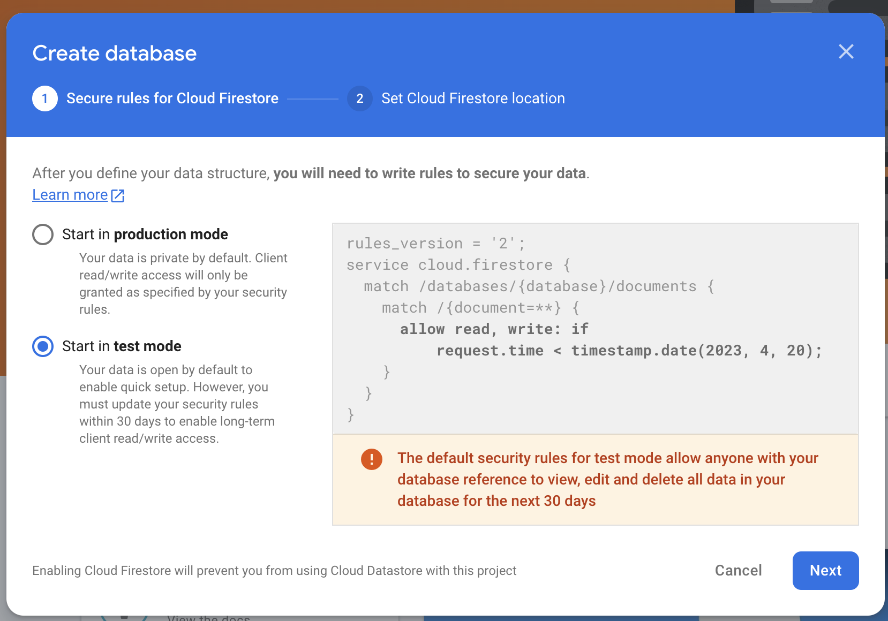
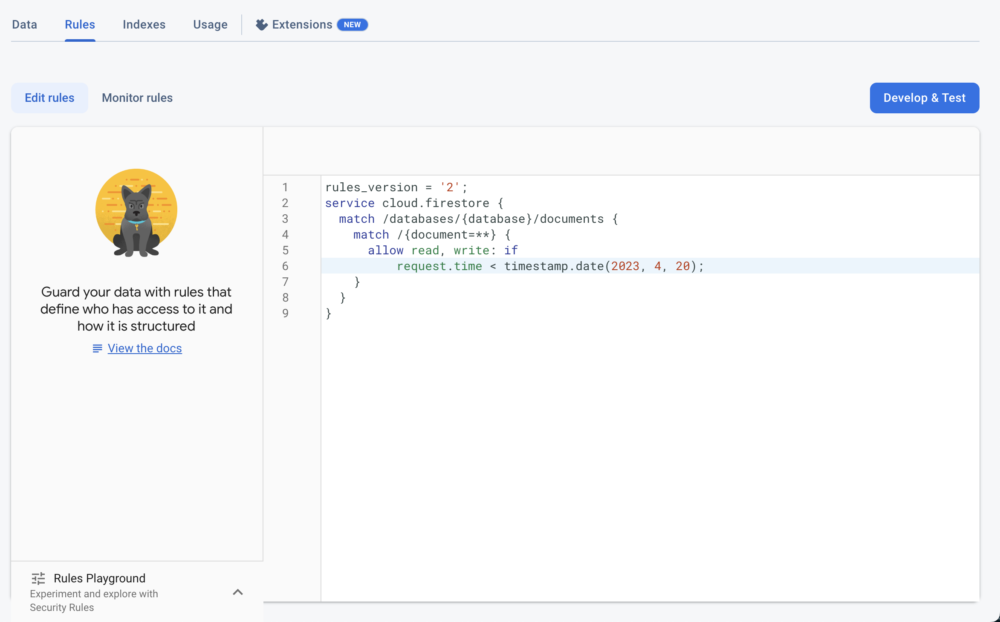

# Client Access to Firestore Expired

You may receive an email from Firebase with the subject:

**"Client access to your Cloud Firestore database expired"**

This message typically appears when your Firestore database is in **Test Mode** and the access duration has expired.

Reason for This Message

    When setting up Firestore for the first time, Firebase offers two rule options:

        1. **Test Mode** – Temporarily allows open access (expires after 30 days).
        2. **Production Mode** – Starts off restricted and requires secure rules.

        

If you selected **Test Mode** during setup, Firestore access will automatically expire after the preset period. To continue using Firestore, you'll need to update the rules using one of the following options:

- **Option 1: Manage Firestore Rules From FlutterFlow**

    You can **[manage and deploy Firestore rules](/integrations/database/cloud-firestore/firestore-rules/)** directly from FlutterFlow.

- **Option 2: Manually Update Firestore Rules in Firebase Console**

    Follow these steps to manually update the rules:

        1. Go to the **[Firebase Console](https://console.firebase.google.com/)**.
        2. Open your project and navigate to **Firestore Database**.
        3. Select the **Rules** tab.

        From here, you have two options:

            - **Option A: Extend Test Mode**

                Update the expiration timestamp to a future date if you're still in development.

                

            - **Option B: Secure Your Rules for Production**

                Update your rules to enforce proper authentication and access controls.

                

If the issue persists, contact us at [support@flutterflow.io](mailto:support@flutterflow.io) for further assistance.
