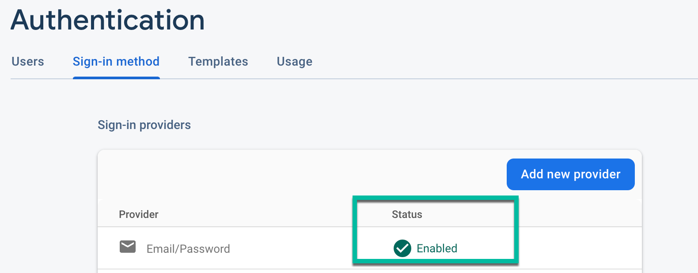
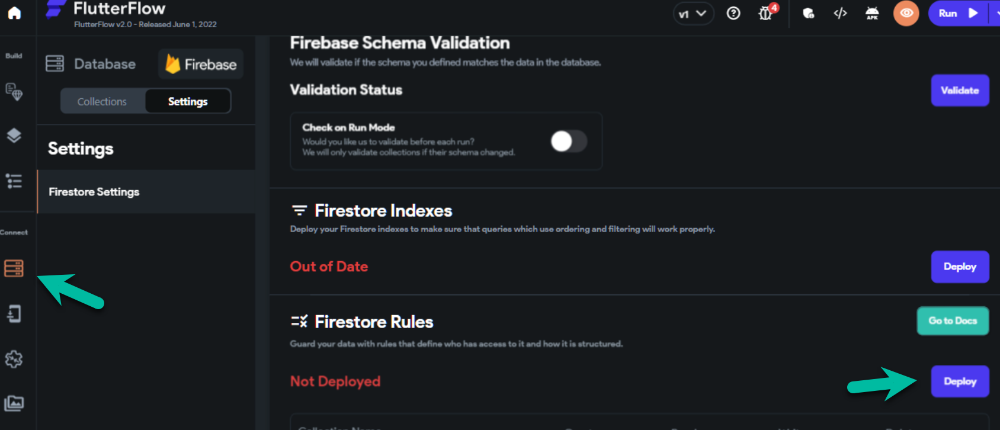

# Content Manager Error: Error Updating Firestore Security Rules

## Issue
This error may appear when attempting to use the FlutterFlow Content Management System (CMS):

```
Error updating Firestore Security Rules... 
Make sure you set up Firebase for your project under "Settings" &gt; "Firebase".
```


## Why This Error Appears
This error occurs when Firebase permissions have not been configured correctly. Fortunately, this can be resolved easily by following the steps below:

### Ensure Email Sign-In Is Enabled
    Open the Firebase console, and click on **Authentication** (in the left side menu).

- Click on the **Get started** button.

- Select the **Sign-in method** tab.

- Check to see if you see Email/Password with that is turned on with a green check **Enabled**:



:::note
If you don't see this, you will need to use these instructions to turn on email sign-in.
:::

### Ensure Required Cloud Permissions Are Added
To enable push notifications, the following cloud permissions must be granted to firebase@flutterflow.io:

- Editor

- Cloud Functions Admin

- Service Account

### Steps: 
- Head to the Firebase Console and open the project dashboard for your project (click the project tile). 

- Select Project Settings &gt; Users &amp; Permissions.


:::info
- If these roles are not listed next to firebase@flutterflow.io, the setup is incomplete.
- If you don't have Cloud Functions Admin, Editor, and Service Account listed next to firebase@flutterflow.io, you have not completed this step.
:::


## Instructions on how to add the required cloud permissions to your project.

- ### Update Your Firebase Rules

    From within your FlutterFlow project, select **Firestore** &gt; **Settings** &gt; Scroll down to **Firestore Rules** &gt; select **Deploy/Redploy**.

 

- ### Ensure Firebase Schema Is Defined

    Ensure you have defined the fields in your Firebase schema. Only fields defined in your Firebase schema are shown in the Firebase Content Manager.

- ### Ensure you are using the latest version of FlutterFlow

    To upgrade to the latest version of FlutterFlow select `Ctrl + R` on Windows or `Cmd + R` on Mac.

After all this is done, clear your browser cache and log out/in to FlutterFlow. If the above wasn't helpful full please make sure you check this Link as well.

## Create Permissions From Scratch
If all previous steps have been completed and the issue continues, remove existing permissions and complete a fresh setup. Refer to the FlutterFlow documentation for a step-by-step guide.