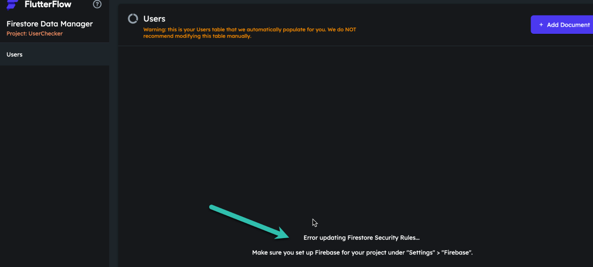
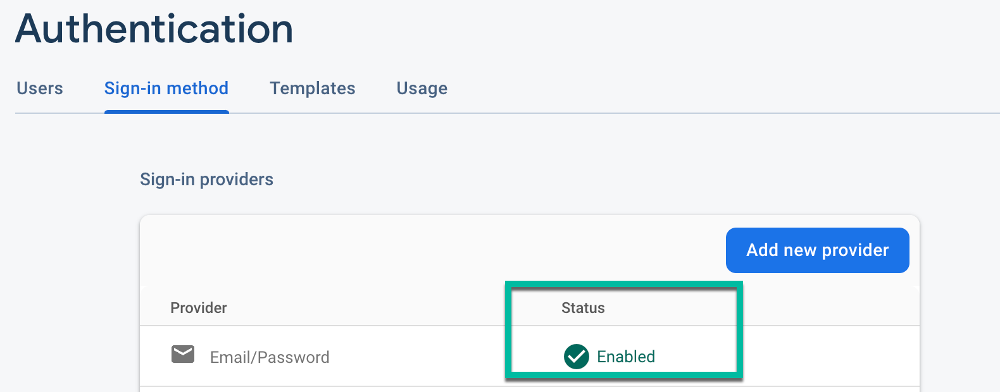
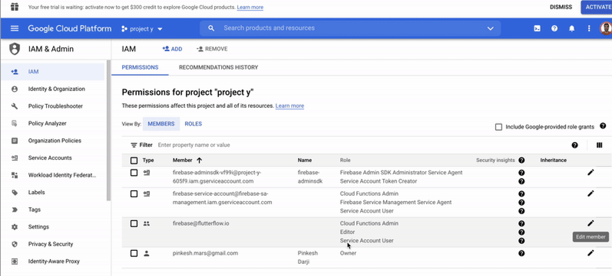
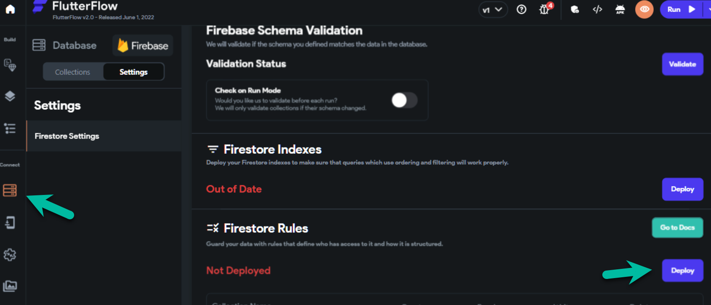

# Content Manager Firestore Error

You may see the following error message when accessing the **FlutterFlow Content Management System (CMS)**:

This error typically occurs when Firebase permissions or authentication settings are not properly configured. Follow the steps below to resolve it.

1. **Enable Email/Password Sign-In**

    1. Open the **[Firebase Console](https://console.firebase.google.com/)**.
    2. Select your project.
    3. From the left-hand menu, click **Authentication**.
    4. Click **Get started** (if not already started).
    5. Go to the **Sign-in method** tab.
    6. Ensure **Email/Password** is listed and marked as **Enabled** ✅.

    

    :::note
    If Email/Password is not enabled, turn it on by clicking the pencil icon and toggling the setting.
    :::

2. **Add Required Firebase Project Permissions**

    FlutterFlow requires the following roles to be granted to `firebase@flutterflow.io` for proper functionality:

    - **Editor**
    - **Cloud Functions Admin**
    - **Service Account Admin**

    To add these permissions:

    1. In the **[Firebase Console](https://console.firebase.google.com/)**, open your project.
    2. Navigate to **Project Settings** > **Users & Permissions**.
    3. Check if `firebase@flutterflow.io` has the roles listed above.

    

    :::info
    If these roles are missing, the integration is incomplete. Make sure to add all three roles.
    :::

3. **Update Firestore Rules in FlutterFlow**

    1. In your FlutterFlow project, go to **Firestore** > **Settings**.
    2. Scroll down to the **Firestore Rules** section.
    3. Click **Deploy/Redeploy** to apply your latest rules.

    

4. **Define Your Firebase Schema**

    Make sure your Firebase schema is fully defined. The Content Manager only displays fields that are already defined in your Firebase schema.

5. **Ensure You're Using the Latest FlutterFlow Version**

    Press `Ctrl + R` (on Windows) or `Cmd + R` (on macOS) to refresh and ensure you’re on the latest version of FlutterFlow.

6. **Clear Cache and Re-Login**

    After completing the above steps:

    - Clear your browser cache.
    - Log out and log back into FlutterFlow.

:::info[Still Not Working?]
Try Reconfiguring Permissions from Scratch
:::

If none of the steps resolve the issue:

1. Remove existing Firebase permissions.
2. Re-add all necessary roles from scratch.
3. Follow the full setup instructions in the **[official FlutterFlow Firebase integration guide](/integrations/firebase/connect-to-firebase/)**.

By following the steps above, you should be able to resolve the error and continue using FlutterFlow CMS without interruptions.