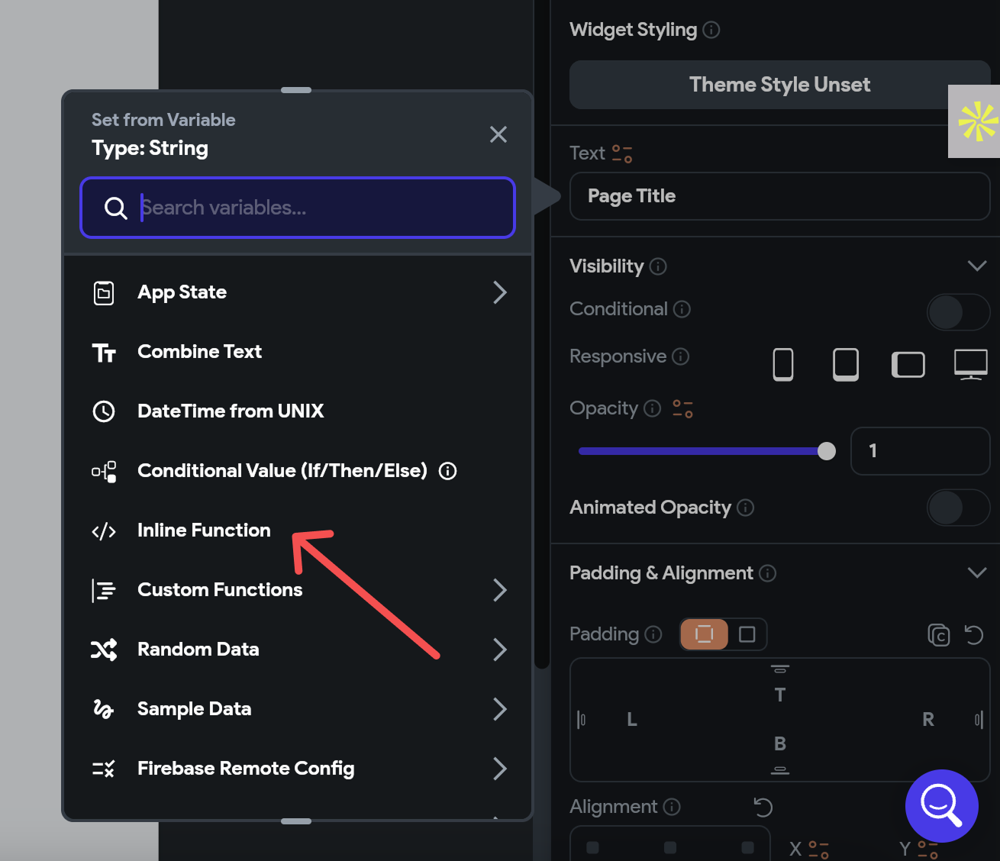
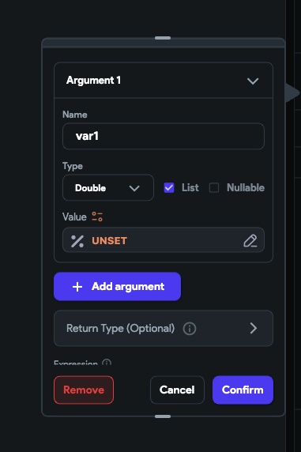
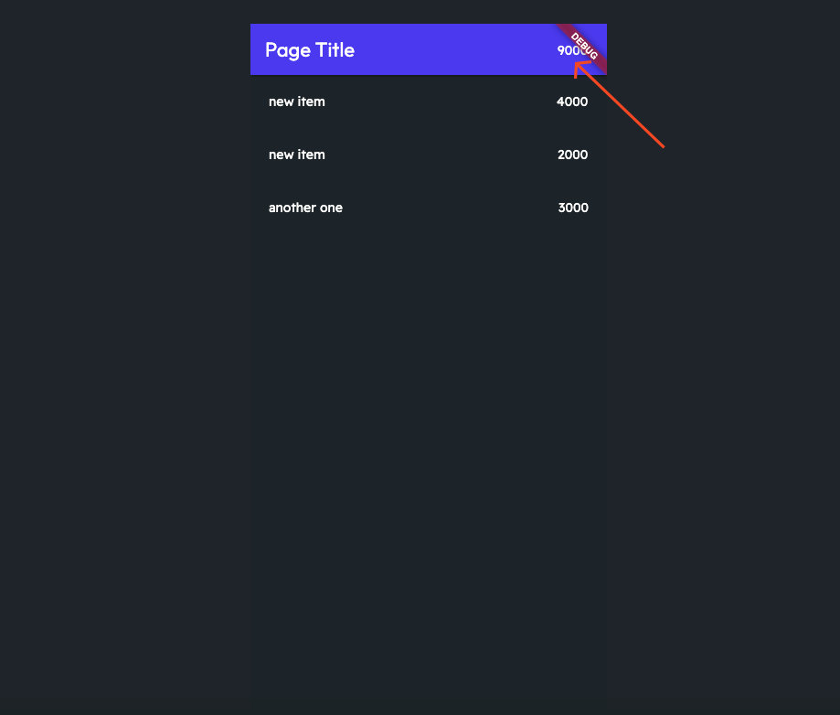

# Get the Sum of Firebase Document or API Values

Sometimes, when working with databases, you might need to calculate the total of all values for a certain item or category. This is especially common when using APIs or working with Firebase. If you're looking to add up values from a database, this easy-to-follow guide is for you. 

## Steps to Get the Sum of Firebase Document or API Values

Follow this simple steps below:

### Step 1: Identify Where You Need the Total

First, decide where in your code you need to display the total sum. This could be a text field or a variable in your code where the final sum will be shown.

### Step 2: Prepare Your Data Type

Next, you need to specify what kind of data you're adding up. For example, if you're working with numbers with decimal points, you'll classify your data as `double`. Make sure to indicate that you're dealing with a list of these values.

### Step 3: Select Your Data

Now, choose the specific data you want to sum up. You do this by picking out the documents from your database query and then mapping out the exact data field you're interested in.

### Step 4: Calculate the Sum

With your list of values ready, store them in a variable (let's call it `var1`). Then, decide on the format you want for your result. Use the `reduce` function to add up all the values in your list, `var1`, to get your total sum.

### Step 5: Checking Your Results

After completing these steps, you should have the total sum displayed where you need it. If it looks right, you've successfully calculated the sum!

