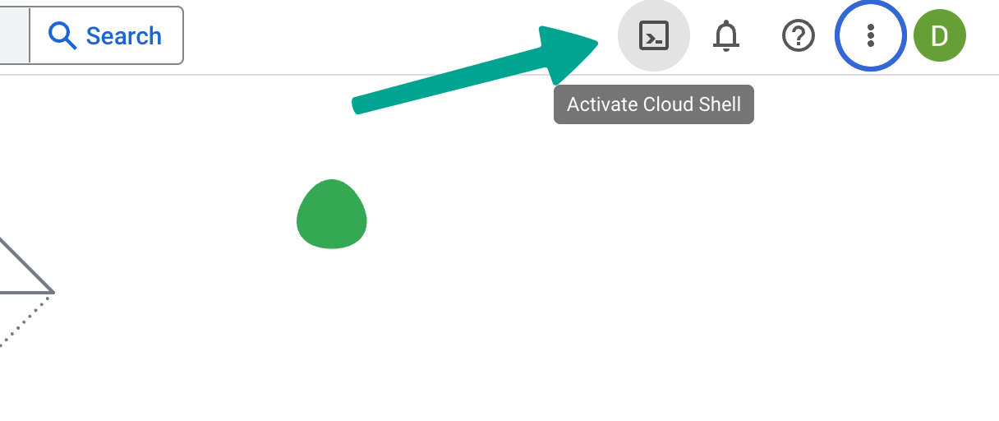
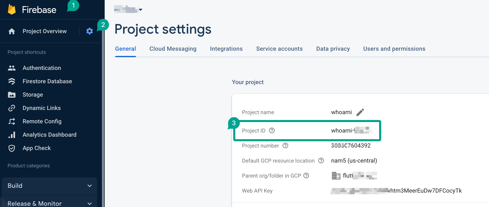
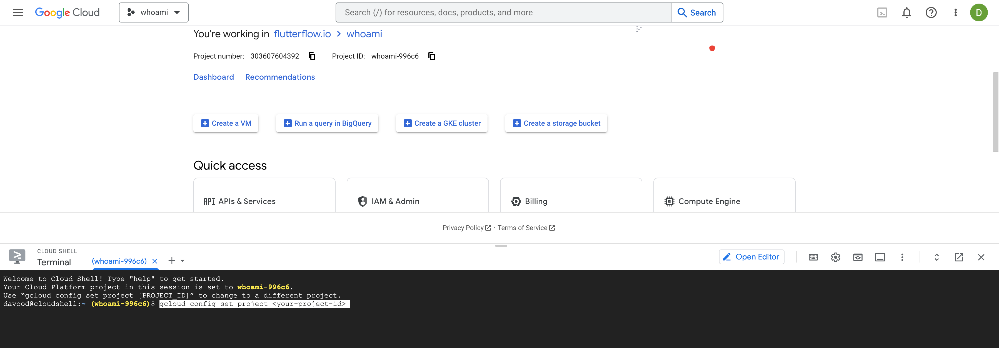

# How to Configure CORS in Firebase Storage

When you deploy your web app to a custom domain, the domain and the Firebase Storage bucket are hosted on different servers. This means that the browser will block requests to the Firebase Storage bucket from your web app, because the origins (the domains and ports) of the two servers are different.

## What is CORS?

CORS stands for **Cross-Origin Resource Sharing**. It allows you to specify which origins are allowed to access your resources. By configuring CORS, you can tell the browser that your web app is allowed to make requests to the Firebase Storage bucket, even though the two servers are hosted on different domains.

## How to configure CORS in Firebase Storage

In Firebase Storage, you can configure CORS by creating a `cors.json` file in your bucket. This file contains a list of origins that are allowed to access your resources.

To create a `cors.json` file, follow these steps:

- Go to the Google Cloud Console: https://console.cloud.google.com​
    

- In the top right corner of the console, click the **Activate Cloud Shell** button and you will see a terminal window inside your current window​

    

    
​

- Run the following command:

```
gcloud config set project &lt;your-project-id&gt;
```

- Navigate to your Firebase Storage bucket:

```
cd gs://&lt;your-bucket-name&gt;
```

- Run the `cors` command to configure CORS:

```
gsutil cors set cors.json gs://&lt;your-bucket-name&gt;
```

You can also specify a list of allowed headers by running the following command:

```
gsutil cors set cors.json gs://&lt;your-bucket-name&gt; --allowed-headers="Content-Type, Authorization"
```

The `cors.json` file contains a list of origins that are allowed to access your resources. Each origin is a string that identifies a domain or port. For example, the following origin allows access from the domain `www.example.com`:

```
"origins": ["https://www.example.com"]
```

You can also specify a list of allowed headers. The following example allows access to the `Content-Type` and `Authorization` headers:

```
"origins": ["https://www.example.com"], "allowedHeaders": ["Content-Type", "Authorization"]
```

For more information on configuring CORS in Firebase Storage, please see the [official documentation](https://firebase.google.com/docs/storage/web/download-files#cors_configuration).


