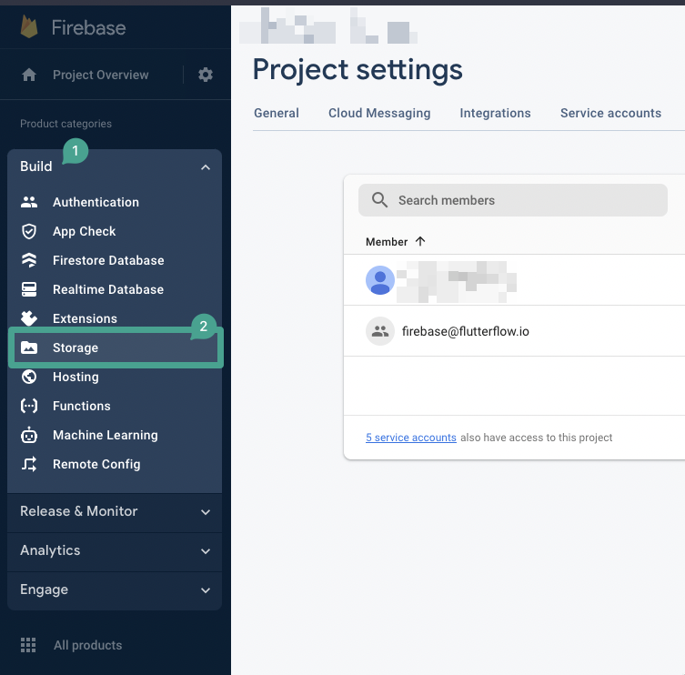

# Missing Firebase storage in FlutterFlow settings

**Issue**

You are trying to set up Firebase Storage in your FlutterFlow project, but the **Firebase Storage** option is missing from the **Firebase Settings** tab.

    

**Why this happens**

    This issue occurs when Firebase Storage has not yet been enabled in the Firebase Console for your project. Until you set it up there, the option will not appear in FlutterFlow.

**How to fix**

Follow these steps to enable Firebase Storage and make it visible in your FlutterFlow settings:

    1. Inside your FlutterFlow project, click on **Firebase** from the left menu and then click **Open Firebase Console**.

        

    2. In the Firebase Console, go to the **Build** menu and click **Storage**.

        

    3. Click **Get started** and complete the setup process.

        

    4. Once the storage bucket is successfully created, return to FlutterFlow. You should now see the **Rules** option under Firebase Settings.

    

:::note
After creating Firebase Storage, it may take up to one hour for the changes to reflect in FlutterFlow.
:::

