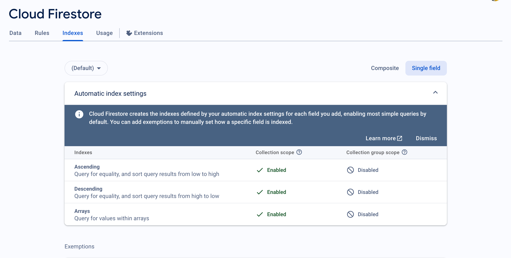

# Resolving Firestore Index Deployment Issues

If your Firestore indexes are not being deployed as expected, follow these troubleshooting steps to resolve the issue and ensure your app performs correctly.

1. **Enable Email Sign-In**

    - Open your Firebase project.
    - Go to **Authentication** > **Sign-in method**.
    - Enable **Email/Password** sign-in.

2. **Grant Proper Permissions**

    - In your Firebase project, open **Project Settings** > **Users and permissions**.
    - Add firebase@flutterflow.io as a member.
    - Assign the following roles:
        - **Editor**
        - **Cloud Functions Admin**
        - **Service Account User**

    

3. **Update Firestore Rules**

    - Update your Firestore rules in both Firebase Console and FlutterFlow.
    - Ensure they match your app’s data access requirements.
    - Follow the detailed steps in the **[Firestore Rules documentation](../integrations/database/cloud-firestore/firestore-rules/)** to correctly configure your rules.

    

4. **Verify Index Deployment**

    - In the Firebase Console, go to **Firestore Database** > **Indexes**.
    - Check that your indexes have been deployed.
    
        :::note
        Deployment may take a few minutes. Refresh the page if you don’t see updates immediately.
        :::

:::tip[Additional Tips]
- Make sure you completed all the steps above before retrying deployment.
- For advanced troubleshooting, check Firebase logs and permissions in Google Cloud Console.
:::

Following these steps should help resolve Firestore index deployment issues in FlutterFlow.
