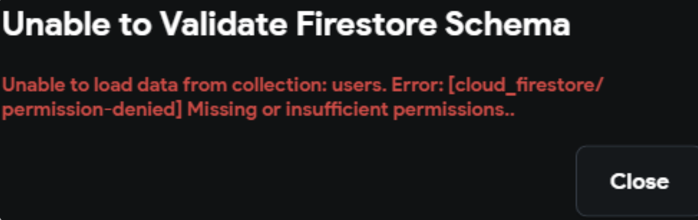
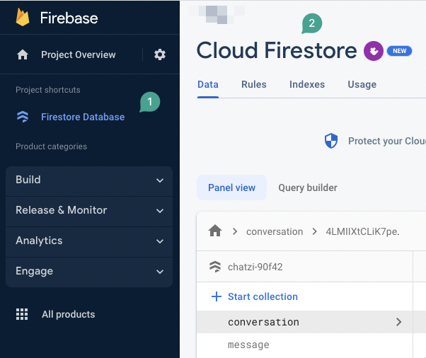
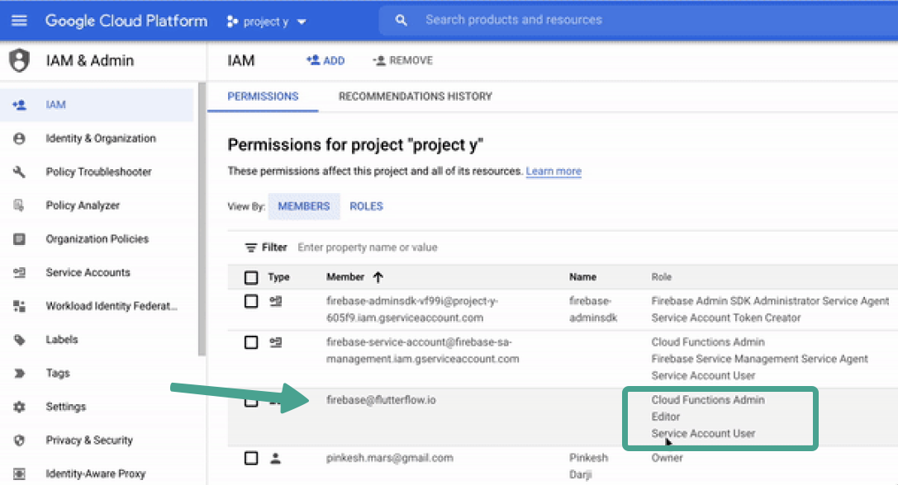
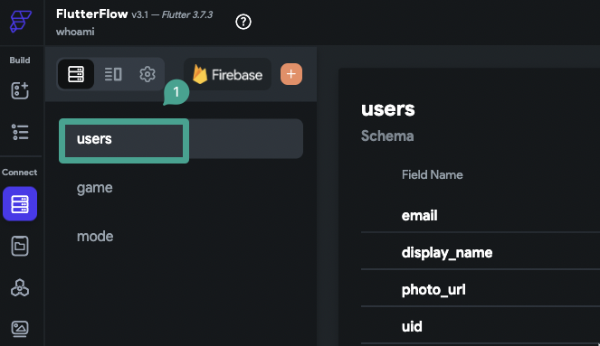
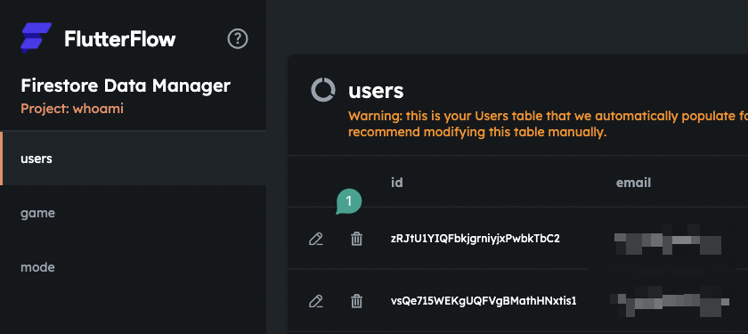

# Unable to validate Firestore Schema: Unable to load data from collection. Missing or insufficient permissions

## Issue: 

You see an error like this when trying to validate your Firestore Schema:

Unable to load data from collection. 
Error: [cloud_firestore/permission-denied] Missing or insufficient permissions.​

## Troubleshooting Steps:

## 1. Make sure you already created a database in firebase**

  

## 2. Make sure your database is not on TEST MODE.

  A Database in Test Mode may not work properly

:::note 
After creating the database in test mode, there is no visual option to switch to production mode directly. Instead, the Firebase rules must be updated manually. However, if the rules are deployed from FlutterFlow, this transition is handled automatically, and the manual update can be skipped.
::: 

### Steps to change your database from test mode to production mode:

1. Go to your firebase project.
2. Select Cloud Firestore.
3. Select Rules.

You will see something like below.​

Change it as follows, 

:::note 
Be sure to specify the correct rules_version and verify that it is accurately reflected in your configuration.
::: 

4) Publish.

The configuration is now successfully switched to Production mode.

Make sure you give the necessary permissions to firebase@flutterflow.io editor account in your firebase project

You will need to add the following cloud permissions for firebase@flutterflow.io: 
**Editor**, **Cloud Functions Admin**, and **Service Account**.

Head to the Firebase Console and open the project dashboard for your project (click the project tile). Select **Project Settings** &gt; **Users** &amp; **Permissions**.

If you don't have Cloud Functions Admin, Editor, and Service Account listed next to firebase@flutterflow.io as seen in the image below, you have not completed this step.

## 3. Make sure you at least one collection created in FlutterFlow

Select the Firestore tab from the left menu. If you have no collections listed, you will need to create one.

## 4. Make sure that at least one of your collections has at least one document.

You can use the CMS in FlutterFlow to confirm that you have at least one document. Select Manage Content and view your collections.

If you don't see any data listed, you will need to add data using the CMS.

## 5. Make sure you deployed your database rules with the proper permissions

From within your FlutterFlow project, select **Firestore** &gt; **Settings** &gt; Scroll down to Firestore Rules &gt; select **Deploy**/**Redploy**.

