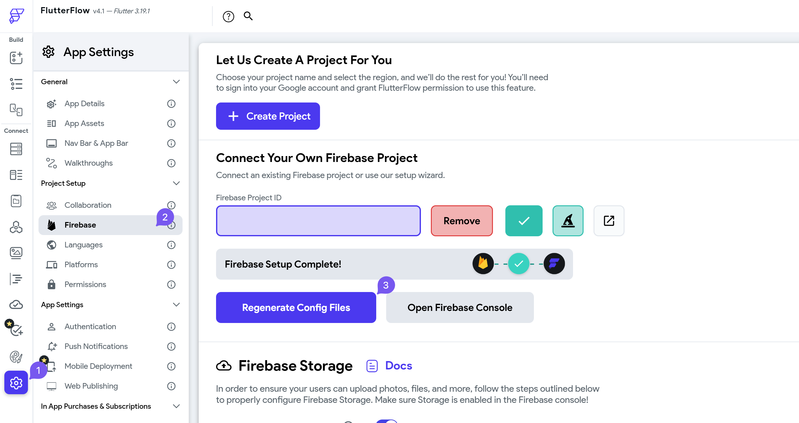

# Warning: Firebase Android Configuration File Has Not Been Uploaded

While working with Firebase, you may come across the error "Warning: Firebase Android configuration file has not been uploaded! Tap to fix." In most cases, this happens when your Firebase configuration files have not been generated.

This issue can be resolved with a few simple steps:

## Solution

1. Ensure that you have completely set up Firebase for your project

    For detailed instructions on setting up Firebase, please refer to the [official Firebase documentation](https://firebase.google.com/docs).

2. Open your **Project Settings**, navigate to **Firebase** 

    

3. Regenerate you Firebase configuration files 

    If you are still having problems, feel free to contact support@flutterflow.io