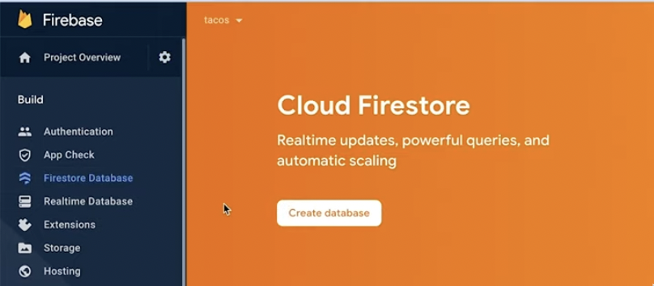
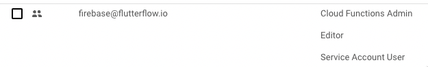

# Can't Deploy Firestore Database Rules

If you're having trouble deploying Firestore Database rules in FlutterFlow, follow the steps below to troubleshoot the issue.

---

## ✅ Step 1: Validate That Firestore Database Has Been Created

FlutterFlow cannot deploy rules if a **Firestore database** has not been created in your Firebase project.

1. Go to the [Firebase Console](https://console.firebase.google.com).
2. Select your project.
3. Click **Create Database** under Firestore.

> 🎥 **Video Reference:**  
> _Create a Firestore database in Firebase_ — watch from **1:50 to 2:05**

---

## ✅ Step 2: Verify Required Permissions

To deploy Firestore rules, you must assign the following roles to `firebase@flutterflow.io`:

- **Editor**
- **Cloud Functions Admin**
- **Service Account User**

### To check or update roles:
1. Go to **Project Settings** > **Users & Permissions** in your Firebase Console.
2. Locate the `firebase@flutterflow.io` service account.
3. Confirm that the three required roles are assigned.

> 📌 If any of the roles are missing, follow [this guide](https://intercom.help/flutterflow/en/articles/7030020-can-t-deploy-firestore-database-rules) to add them.

---

## ✅ Step 3: Confirm GCP Location is Selected

FlutterFlow cannot deploy rules if a GCP location hasn’t been selected.

1. In Firebase Console, go to **Project Settings** > **General**.
2. Under **Default GCP Resource Location**, check if a location is selected.

If it shows **“Not yet selected”**, click the **pencil icon** to complete setup.

> ⚠️ **Note:** This selection **cannot be changed** later. [Learn more about location selection](https://firebase.google.com/docs/projects/locations).

---

## 🎉 You're Done!

After completing these three checks:
- ✅ Firestore is created
- ✅ Permissions are assigned
- ✅ GCP location is set

...you should now be able to successfully deploy your Firestore database rules from FlutterFlow.

