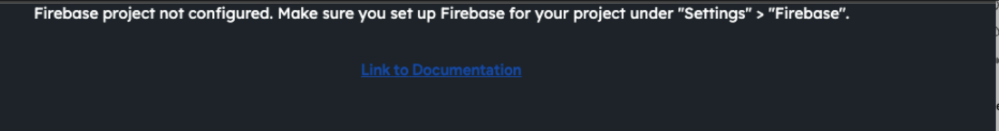

# Fix Firebase Project Not Configured Error in Settings

This article explains how to resolve the **Firebase project not configured** error that may appear when accessing the Content Manager (CMS) in FlutterFlow.

## :::info[Prerequisites]
- You must have a Firebase project already set up.
- Ensure the Firebase project is linked in your FlutterFlow project under **Settings > Firebase**.
:::

## Steps to Resolve the Issue

1. **Verify Firebase Setup**
   - In FlutterFlow, go to **Settings > Firebase**.
   - Confirm that all required Firebase configuration fields are filled.

2. **Trigger a Project Update**
   - Make a minor, non-breaking change to your project (e.g., add and delete a dummy widget).
   - This forces FlutterFlow to sync and update your Firebase settings.

3. **Reload the CMS**
   - Return to the **CMS** tab and reload the page.
   - Check if the error persists.

   

4. **Contact Support if Needed**
   - If the issue continues after performing these steps, contact FlutterFlow Support:
     - **Email:** [support@flutterflow.io](mailto:support@flutterflow.io)
     - **Chat:** Available in the FlutterFlow app interface.

## :::note
This issue typically occurs when Firebase has not been properly initialized in the project settings. Triggering a rebuild helps reestablish the necessary configurations.
:::

