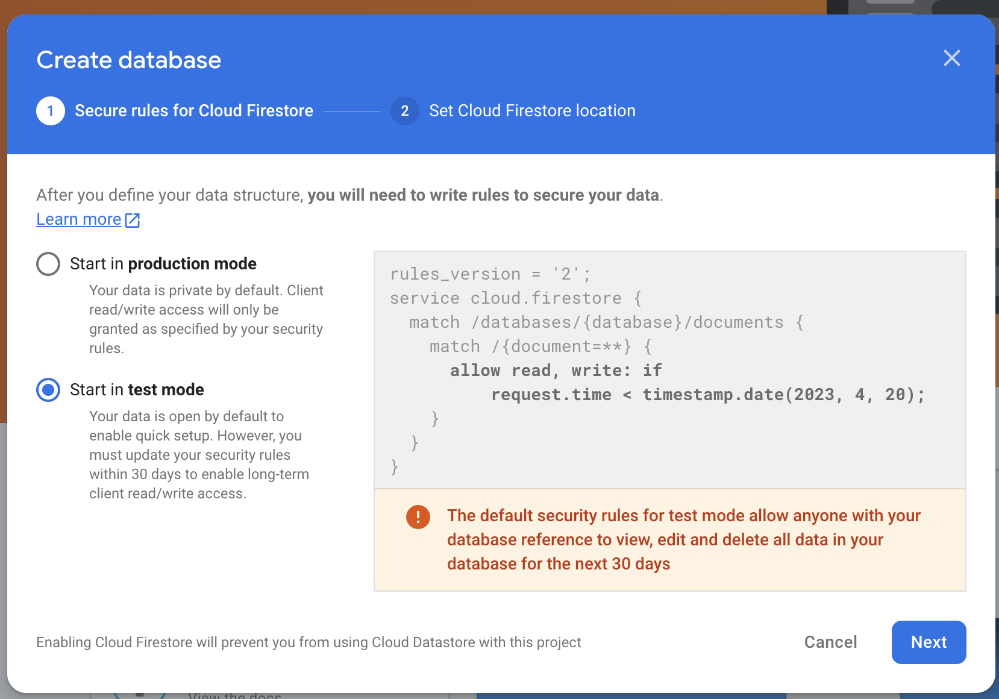
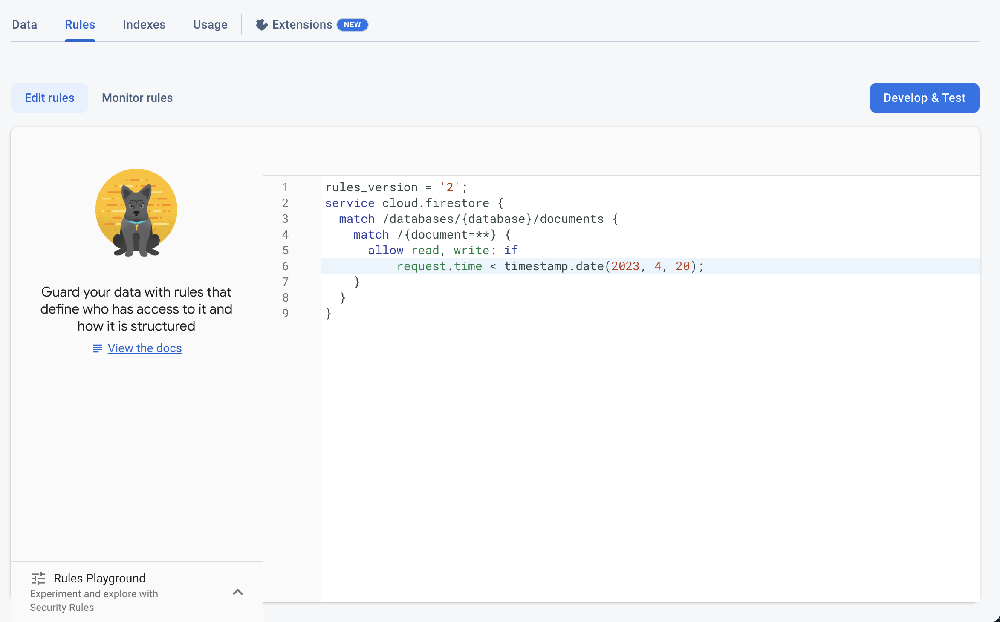
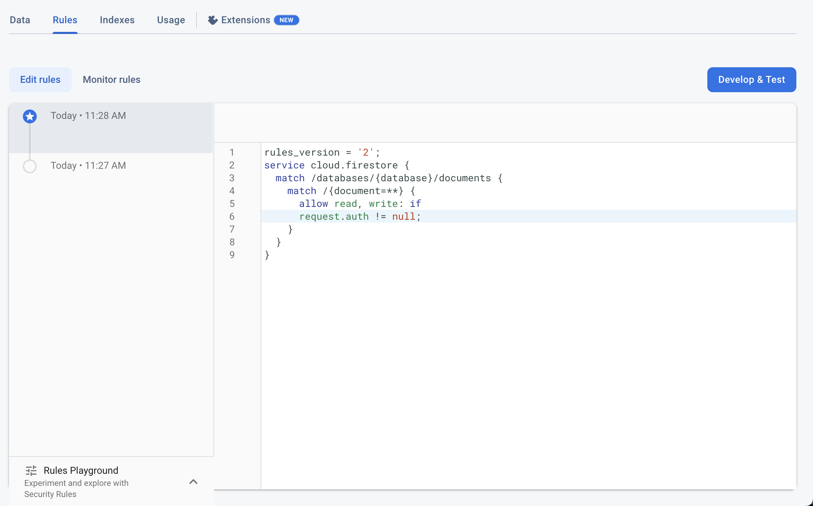

---
keywords:
  - database
  - firebase
  - client
slug: /troubleshooting/firebase/client-access-to-firestore-expired
title: Client Access to Firestore Expired
description: >-
  Learn how to diagnose and resolve Client Access to Firestore Expired in
  FlutterFlow with symptom, cause, and recovery guidance.
tags:
  - FlutterFlow
  - Troubleshooting
  - Firebase
last_verified: 2026-09-02
---
# Client Access to Firestore Expired

You may receive an email from Firebase with the subject:

**"Client access to your Cloud Firestore database expired"**

This message typically appears when your Firestore database is in **Test Mode** and the access duration has expired.

You are seeing this error message because of the following:

    When setting up Firestore for the first time, Firebase offers two rule options:

        1. **Test Mode** – Temporarily allows open access (expires after 30 days).
        2. **Production Mode** – Starts off restricted and requires secure rules.

        

If you selected **Test Mode** during setup, Firestore access will automatically expire after the preset period. To continue using Firestore, you'll need to update the rules using one of the following options:

- **Option 1: Manage Firestore Rules From FlutterFlow**

    You can **[manage and deploy Firestore rules](/integrations/database/cloud-firestore/firestore-rules/)** directly from FlutterFlow.

- **Option 2: Manually Update Firestore Rules in Firebase Console**

    Follow these steps to manually update the rules:

        1. Go to the **[Firebase Console](https://console.firebase.google.com/)**.
        2. Open your project and navigate to **Firestore Database**.
        3. Select the **Rules** tab.

        From here, you have two options:

            - **Option A: Replace Test Rules in Development**

                Write least-privilege development rules for the signed-in users and data you actually test. Do not keep extending a public time-based allow rule; anyone who discovers the project can access data while it remains open.

                

            - **Option B: Secure Your Rules for Production**

                Update your rules to enforce proper authentication and access controls.

Test the final rules with the Firebase Emulator Suite or Rules Playground for signed-out, owner, non-owner, create, update, and delete cases. Security Rules are not filters, and server Admin SDK access is governed by IAM rather than these client rules.

                

If the issue persists, contact us at [support@flutterflow.io](mailto:support@flutterflow.io) for further assistance.
