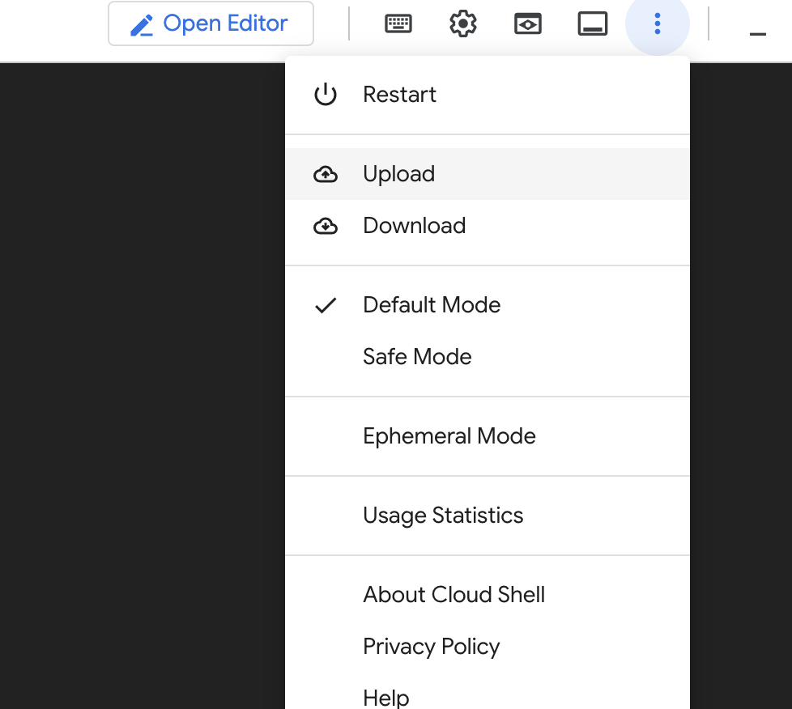

# Configuring CORS for Firebase Storage

When you deploy your web app to a custom domain, the domain and the Firebase Storage bucket are hosted on different servers. This means that the browser will block requests to the Firebase Storage bucket from your web app, because the origins (the domains and ports) of the two servers are different.

**What is CORS?**

CORS stands for **Cross-Origin Resource Sharing**. It allows you to specify which origins are allowed to access your resources. By configuring CORS, you can tell the browser that your web app is allowed to make requests to the Firebase Storage bucket, even though the two servers are hosted on different domains.

Follow these steps to configure CORS for your Firebase Storage bucket:

1. Open **[Google Cloud Console](https://console.cloud.google.com)**.

2. **Launch the Cloud Shell**:

    Click the **Activate Cloud Shell** icon in the top-right corner.

    

    Wait for the terminal to load.

    
​

3. **Run the following Command:**

    ```jsx
    gcloud config set project your-firebase-project-id;
    ```

4. **Define and upload your cors.json file:**
   
   The `cors.json` file contains a list of origins that are allowed to access your resources. Each origin is a string that identifies a domain or port. For example, the following origin allows access from the domain `www.example.com`:

    ```jsx
    "origins": ["https://www.example.com"]
    ```

    You can also specify a list of allowed headers. The following example allows access to the `Content-Type` and `Authorization` headers:

    ```jsx
    "origins": ["https://www.example.com"], "allowedHeaders": ["Content-Type", "Authorization"]
    ```

    To allow any origin to access your resource, you can use `*`. The `cors.json` file below allows any origin to access, but not modify your resources. 

    ```jsx
    [
        {
            "origin": ["*"],
            "method": ["GET"],
            "maxAgeSeconds": 3600
        }
    ]
    ```

    Once you have defined your `cors.json` file, upload it to Google Cloud Console. 

    

    To confirm that you have uploaded it correctly, you can run `ls` in your console and you should see your `cors.json` file listed.


5. **Run the `cors` Command to Configure CORS:**

    ```jsx
    gcloud storage buckets update gs://your-google-storage-bucket-name --cors-file=cors.json
    ```

6. **(Optional) Confirm success by viewing the CORS of your bucket**
   
   Run the following command to confirm that the rules from your `cors.json` file were applied. 
   ```jsx
   gcloud storage buckets describe gs://your-google-storage-bucket-name --format="default(cors_config)"
   ```
   You should see the same allowed origins and any other info defined in your `cors.json` file. 

For more information on configuring CORS in Firebase Storage, please see the **[official documentation](https://firebase.google.com/docs/storage/web/download-files#cors_configuration)**.


