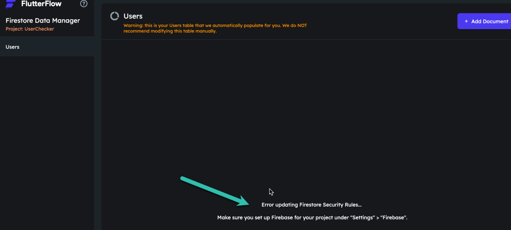
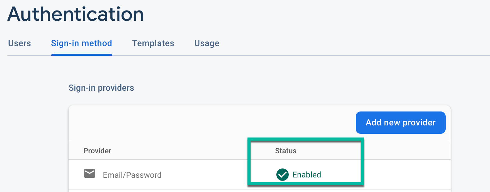
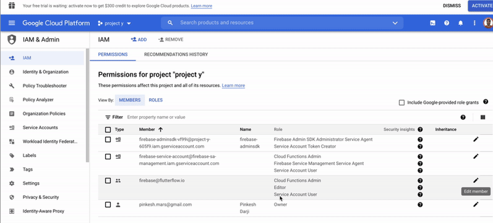
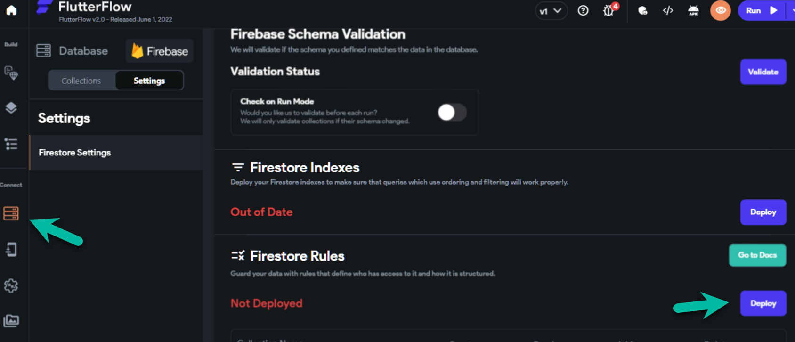

---
keywords:
  - security
  - error
  - firebase
  - permissions
slug: /troubleshooting/firebase/content-manager-firestore-error
title: Content Manager Firestore Error
description: >-
  You may see the following error message when accessing the FlutterFlow Content
  Management System (CMS) : This error typically occurs when Firebase
  permissions or authentication...
tags:
  - FlutterFlow
  - Troubleshooting
  - Firebase
last_verified: 2026-09-02
---
# Content Manager Firestore Error

You may see the following error message when accessing the **FlutterFlow Content Management System (CMS)**:

This error typically occurs when Firebase permissions or authentication settings are not properly configured. Follow the steps below to resolve it.

1. **Enable Email/Password Sign-In**

    1. Open the **[Firebase Console](https://console.firebase.google.com/)**.
    2. Select your project.
    3. From the left-hand menu, click **Authentication**.
    4. Click **Get started** (if not already started).
    5. Go to the **Sign-in method** tab.
    6. Ensure **Email/Password** is listed and marked as **Enabled** ✅.

    

    :::note
    If Email/Password is not enabled, turn it on by clicking the pencil icon and toggling the setting.
    :::

2. **Add Required Firebase Project Permissions**

    Follow the current [Firebase connection permissions](/integrations/firebase/connect-to-firebase/#allow-flutterflow-to-access-your-project) for `firebase@flutterflow.io`. Do not add Owner, Service Account Admin, or other broad roles as a generic Content Manager fix unless the current setup guide explicitly requires them for the operation.

    To add these permissions:

    1. In the **[Firebase Console](https://console.firebase.google.com/)**, open your project.
    2. Navigate to **Project Settings** > **Users & Permissions**.
    3. Check whether the service account has the documented roles and whether an organization-policy denial is shown in the exact error.

    

    :::info
    Grant only the roles required by the current connection workflow and your enabled features.
    :::

3. **Update Firestore Rules in FlutterFlow**

    1. In your FlutterFlow project, go to **Firestore** > **Settings**.
    2. Scroll down to the **Firestore Rules** section.
    3. Click **Deploy/Redeploy** to apply your latest rules.

    

4. **Define Your Firebase Schema**

    Make sure your Firebase schema is fully defined. The Content Manager only displays fields that are already defined in your Firebase schema.

5. **Ensure You're Using the Latest FlutterFlow Version**

    Press `Ctrl + R` (on Windows) or `Cmd + R` (on macOS) to refresh and ensure you’re on the latest version of FlutterFlow.

6. **Refresh the Account Session When Indicated**

    After completing the above steps:

    - If the error indicates an expired FlutterFlow session, log out and back in.
    - Otherwise, preserve the error and request ID; clearing all browser data does not fix IAM, rules, schema, or Firebase Auth configuration.

:::info[Still not working?]
If none of the steps resolve the issue:
1. Compare the current roles with the **[official FlutterFlow Firebase integration guide](/integrations/firebase/connect-to-firebase/)**.
2. Review Firestore Rules and the authenticated Content Manager user separately from Google Cloud IAM.
3. Do not remove working roles or production rules without a rollback plan.
:::

By following the steps above, you should be able to resolve the error and continue using FlutterFlow CMS without interruptions.
