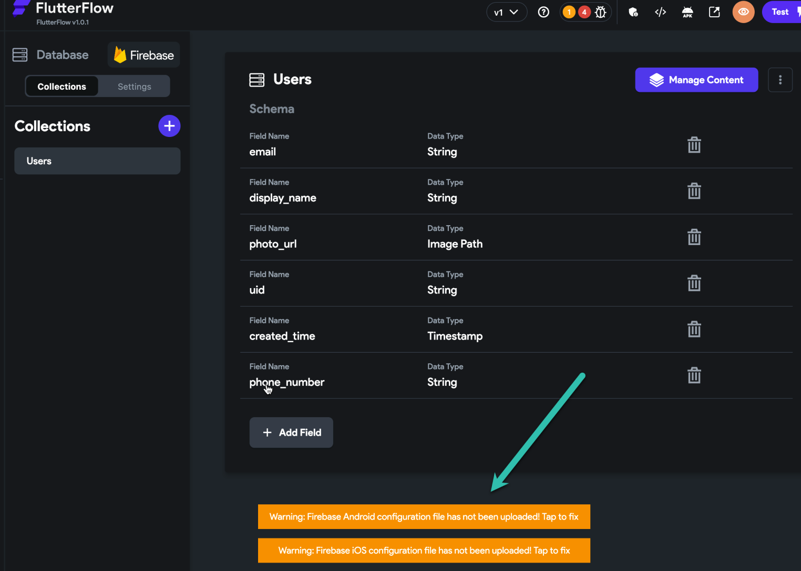
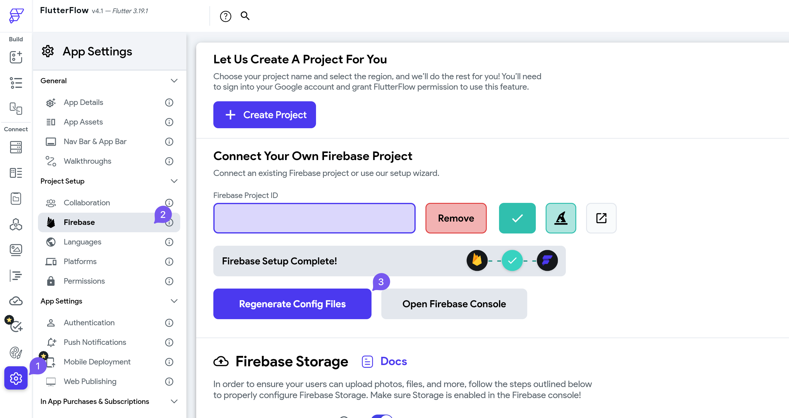

# Firebase Android Config File Missing

You may see the following warning in FlutterFlow, as shown in the image below:

This typically means that the Firebase Android configuration file (`google-services.json`) has not been generated or uploaded to your FlutterFlow project.

Follow the steps below to fix the issue:

1. **Verify your Firebase Setup**

   Make sure that Firebase has been fully configured for your project. Follow the **[Firebase setup guide](/integrations/firebase/connect-to-firebase/)** to ensure all required steps have been completed.

2. **Open Project Settings in FlutterFlow**

   - Navigate to your FlutterFlow project.
   - From the left menu, select **Settings > Firebase**.

    

3. **Regenerate your Firebase Configuration Files**

   - In the Firebase Settings screen, click **Regenerate Firebase Files** to create new configuration files and upload them automatically.

4. **Contact Support if Needed**

   If you continue to experience issues, reach out to [FlutterFlow Support](mailto:support@flutterflow.io) for further assistance.

:::note
The configuration file is required for successful builds and deployment on Android. Make sure it remains up-to-date if you make changes in your Firebase project.
:::
