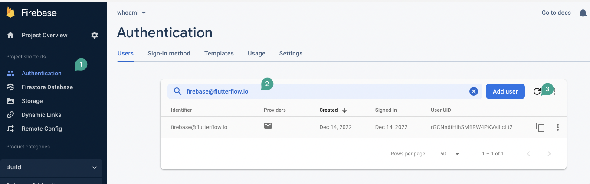

# Fix CMS Access Error with firebase@flutterflow.io Account

This error occurs when the `firebase@flutterflow.io` service account cannot access your Firebase project through the CMS. This typically happens when multiple FlutterFlow projects are connected to the same Firebase project, resulting in authentication conflicts.

:::info[Prerequisites]
- Your FlutterFlow project must be integrated with Firebase.
- You should have access to Firebase Console and Authentication settings.
:::

Follow the steps below to resolve the error:

1. Open your **Firebase Console** and navigate to **Authentication > Users**.

   

2. In the user list, search for the service account email:  
   `firebase@flutterflow.io`

   

3. Select the account and remove it from the authentication table.

4. Return to **CMS** in FlutterFlow and refresh the page.

:::note
This issue can occur when multiple FlutterFlow projects are connected to the same Firebase database. Each project attempts to manage content through the `firebase@flutterflow.io` service account, which can lead to permission conflicts. Remov
:::