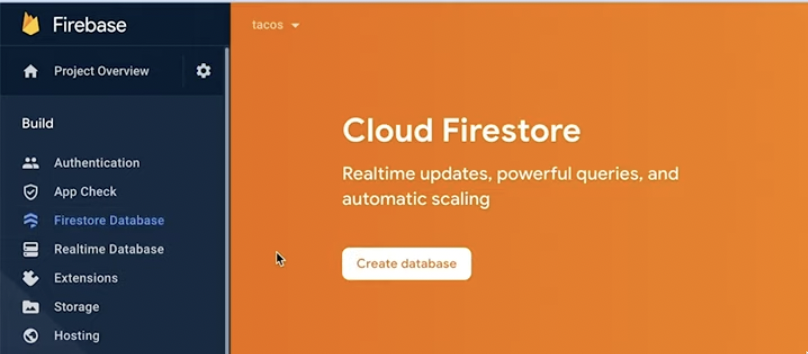
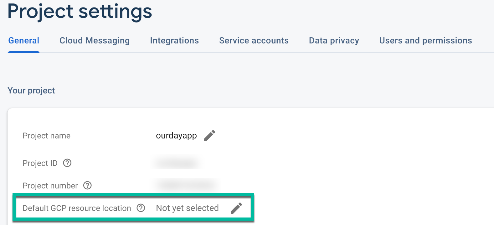

# Fix Firestore Database Rules Deployment Errors

This guide outlines steps to resolve issues when deploying Firebase Firestore rules from FlutterFlow. These deployment errors are usually caused by missing configurations in your Firebase project.

:::info[Prerequisites]
Ensure you have connected your Firebase project to FlutterFlow and logged into the Firebase Console with the necessary permissions.
:::

Follow the steps below to fix deployment errors:

1. Create a Firestore Database

FlutterFlow cannot deploy rules unless a Firestore database has been created.

- Open the [Firebase Console](https://console.firebase.google.com/).
- Select your project.
- Navigate to **Firestore Database** and click **Create Database**.

**Video Reference**: Watch from 1:50 to 2:05 to see how to create the database.

2. Assign Required Firebase Permissions

Ensure the following roles are granted to `firebase@flutterflow.io`:

- `Editor`
- `Cloud Functions Admin`
- `Service Account User`

To verify or update permissions:

- In the Firebase Console, go to **Project Settings > Users and Permissions**.
- Confirm the required roles are assigned.

3. Select a GCP Location

Firestore requires a location to be set before rules can be deployed.

- In Firebase Console, go to **Project Settings > General**.
- Look for **Default GCP Resource Location**.
- If it shows **Not yet selected**, click the pencil icon and select a location.

:::tip
Once the GCP location is set, it cannot be changed. Refer to the [GCP location guide](https://firebase.google.com/docs/projects/locations) for more information.
:::

**Final Check:**

    After completing these steps:

        - Return to FlutterFlow.
        - Attempt to deploy your Firestore rules again.

        If the issue persists, ensure all roles were saved correctly and the database is active.