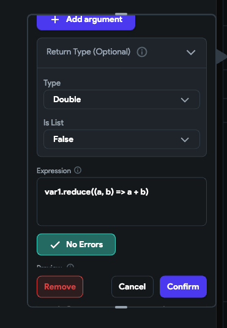

# Get the Sum of Firebase Document or API Values

Sometimes you need to display a total, such as a subtotal or count based on data fetched from Firebase or an API. This guide walks you through the steps to calculate and display that sum in FlutterFlow.

:::info[Prerequisites]
- A working Firebase collection or API that returns numeric values.
- A FlutterFlow UI component (example, **Text**) where the sum will be displayed.
:::

**Steps to Calculate the Sum of Firebase Document or API Values**

1. **Identify where to Display the Total**

    Decide where in your app the total will appear. For example, insert a **Text** widget that will show the computed sum.

    

2. **Prepare your Data Type**

    Next, you need to specify what kind of data you're adding up. For example, if you're working with numbers with decimal points, you'll classify your data as double. Make sure to indicate that you're dealing with a list of these values.

    

3. **Retrieve and Map your Data**

    When fetching data from Firebase or an API, extract the values you want to sum. Use the `map()` function to create a list of those values.

    

4. **Calculate the Sum**

    With your list of values ready, store them in a variable (let's call it `var1`). Then, decide on the format you want for your result. Use the `reduce` function to add up all the values in your list, `var1`, to get your total sum.

    

5. **Checking Your Results**

    After completing these steps, you should have the total sum displayed where you need it. If it looks right, you've successfully calculated the sum!

    

:::tip[Trobleshooting]
- Use `.isNotEmpty` to prevent errors when the list is empty.
- Format the output using `.toStringAsFixed(2)` to show 2 decimal places if needed.
- Optional: Store the sum in a global variable for use across multiple pages.
:::