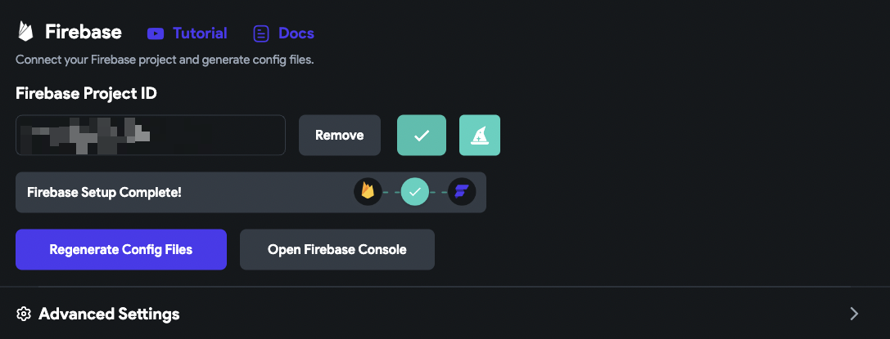
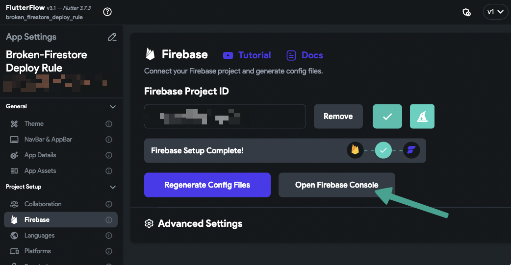
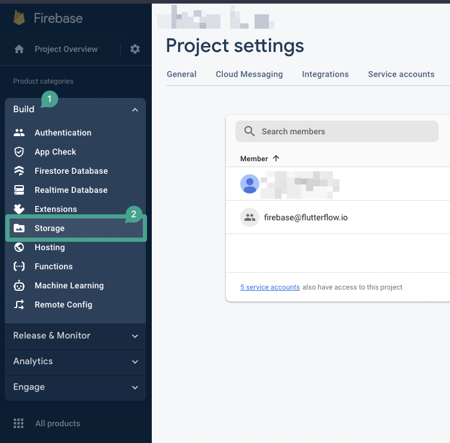
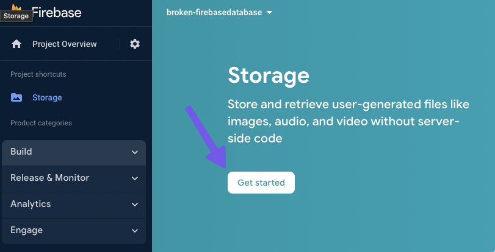
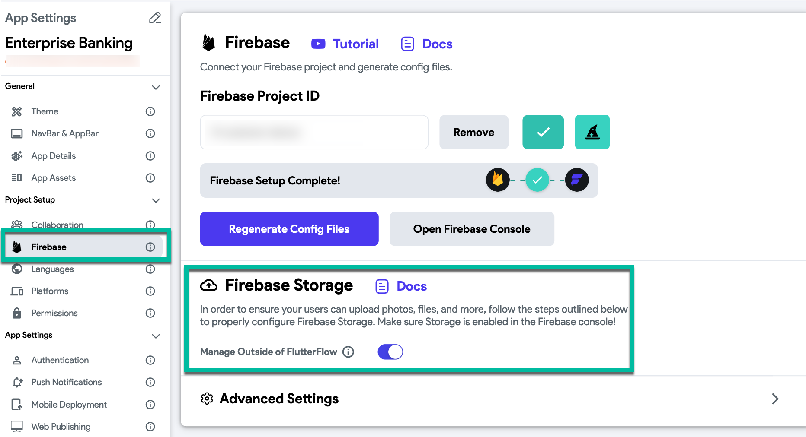

# Missing Firebase Storage in FlutterFlow Settings

When setting up Firebase Storage in your FlutterFlow project, you may notice that the **Firebase Storage** option is missing from the **Firebase Settings** tab.

    

This usually happens when Firebase Storage has not been enabled for your project in the Firebase Console. Until it’s enabled there, the option won’t appear in FlutterFlow.

Follow these steps to enable Firebase Storage and make it available in your FlutterFlow settings:

1. In your FlutterFlow project, click **Firebase** from the left menu, then click **Open Firebase Console**.

    

2. In the Firebase Console, go to the **Build** menu and select **Storage**.

    

3. Click **Get started** and complete the setup process.

    

4. After successfully creating the storage bucket, return to FlutterFlow. You should now see the **Rules** option under **Firebase Settings**.

    

:::note
After setting up Firebase Storage, it may take up to one hour for the changes to appear in FlutterFlow.
:::