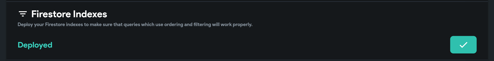
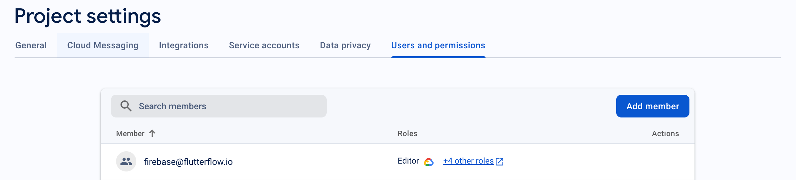
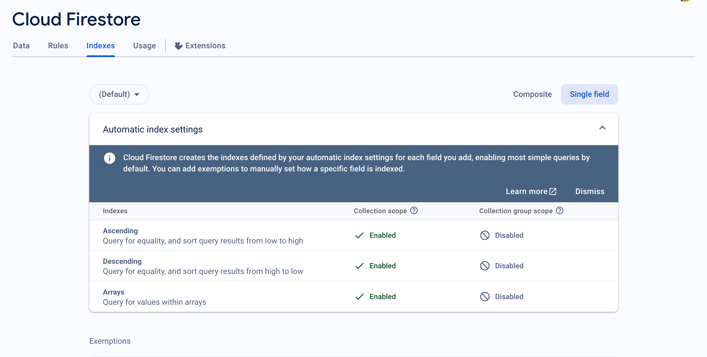

---
keywords:
  - firebase
  - deployment
  - firestore
  - fix a missing Firestore index deployment error
slug: /troubleshooting/firebase/resolving-firestore-index-deployment-issues
title: Resolving Firestore Index Deployment Issues
description: >-
  If your Firestore indexes are not being deployed as expected, follow these
  troubleshooting steps to resolve the issue and ensure your app performs
  correctly.
tags:
  - FlutterFlow
  - Troubleshooting
  - Firebase
ai_queries:
  - fix a missing Firestore index deployment error
last_verified: 2026-09-02
---
# Resolving Firestore Index Deployment Issues

If your Firestore indexes are not being deployed as expected, follow these troubleshooting steps to resolve the issue and ensure your app performs correctly.

1. **Capture the Exact Index Error**

    - A failed query often includes a Firebase Console link that describes the required composite index. Confirm the project, collection/query scope, fields, and sort directions before creating it.

2. **Grant Proper Permissions**

    - In your Firebase project, open **Project Settings** > **Users and permissions**.
    - Add firebase@flutterflow.io as a member.
    - Follow the current [Firebase connection permission guide](/integrations/firebase/connect-to-firebase/#allow-flutterflow-to-access-your-project). Index deployment needs the relevant datastore index permissions; do not grant Cloud Functions or broad Editor access merely because an index failed.

    

3. **Review Firestore Rules Separately**

    - Rules can deny an otherwise indexed query, but deploying an index does not change authorization. Ensure rules match the app's access requirements and keep one declared source of truth to avoid overwriting manual changes.
    - Follow the detailed steps in the **[Firestore Rules documentation](/integrations/database/cloud-firestore/firestore-rules/)** to correctly configure your rules.

    

4. **Verify Index Deployment**

    - In the Firebase Console, go to **Firestore Database** > **Indexes**.
    - Check that your indexes have been deployed.

        :::note
        Deployment may take a few minutes. Refresh the page if you don’t see updates immediately.
        :::

:::tip[Additional Tips]
- Make sure you completed all the steps above before retrying deployment.
- For advanced troubleshooting, check Firebase logs and permissions in Google Cloud Console.
:::

Following these steps should help resolve Firestore index deployment issues in FlutterFlow.
