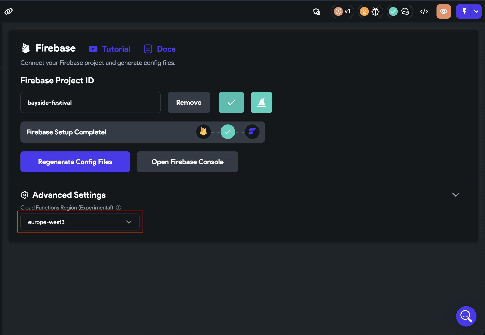
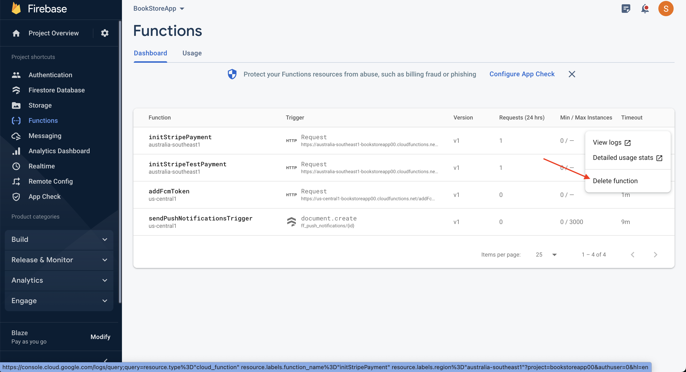
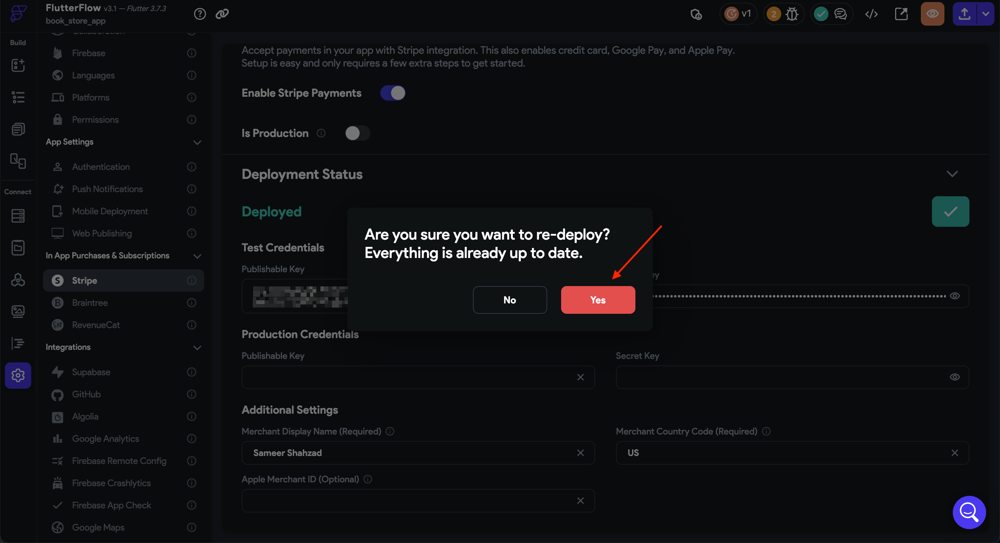

# Resolve Stripe Payment Error Caused by CORS Region Mismatch

This article explains how to resolve the **"Unknown Error Occurred"** issue during Stripe payment actions, caused by a mismatch between the Cloud Functions region and the Firebase project region.

- **Snackbar**: `Unknown Error Occurred`
- **Console**:

    ```text
    Access to fetch at 'https://us-central1-[project].cloudfunctions.net/initStripeTestPayment'
    from origin 'https://ff-debug-service-frontend-*.a.run.app' has been blocked by CORS policy:
    Response to preflight request doesn't pass access control check:
    Redirect is not allowed for a preflight request.
    ```

This error occurs when the Cloud Function is deployed in a region that does not match the region configured in your Firebase project. This region mismatch leads to a **CORS (Cross-Origin Resource Sharing)** error.

Follow the steps below to resolve this error:

1. **Open Firebase Settings**  
    In FlutterFlow, navigate to **Settings > Firebase**.  
    You can also open the command palette using `⌘+K` (macOS) or `Ctrl+K` (Windows) and search for "Firebase".

2. **Set the Cloud Functions Region**  
    Click **Show Advanced Settings**.  
    In the **Cloud Functions Region** dropdown, select **[Default]** or match it with your Firebase region.

    

3. **Delete Deployed Functions from Firebase**  
    Go to the Firebase Console and manually delete any previously deployed Cloud Functions.

    

4. **Re-deploy Stripe Integration**  
    In FlutterFlow, re-deploy the Stripe integration after adjusting the region.

    

:::warning
Ensure that the Cloud Functions region set in FlutterFlow exactly matches the region configured in your Firebase project. Region mismatches will result in CORS errors during runtime.
:::

If the issue persists after following these steps, contact support at **support@flutterflow.io**.
