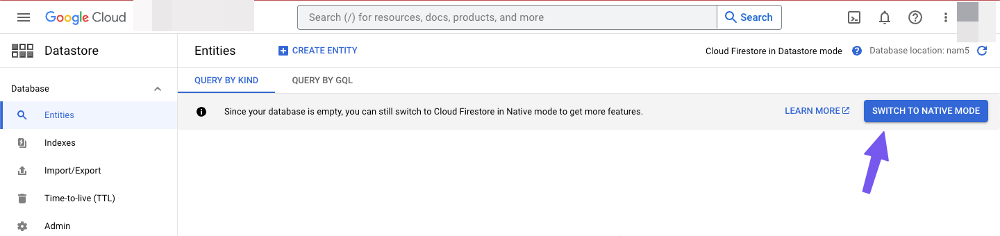

# Switch Firestore to Native Mode

To use `Cloud Firestore` with FlutterFlow, your database must be in `Native Mode`. If your project is currently using `Datastore Mode`, you will need to switch it to `Native Mode` through the Google Cloud Console.

:::info[Prerequisites]
- You must have a Firebase project already connected to your FlutterFlow app.
- Your Firestore database must currently be in `Datastore Mode`.
:::

Follow the steps below to switch to Native Mode:

1. **Open Google Cloud Console**  
   In the Firebase Console, under Firestore settings, click **Go to Google Cloud Console**.

   

2. **Switch to Native Mode**  
   In the Cloud Console, click the **Switch to Native Mode** button.

   

3. **Reload Firestore in Firebase**  
   Return to the Firebase Console and refresh the **Cloud Firestore** page to confirm the switch.

   

:::warning
This action cannot be undone. Switching to `Native Mode` is permanent. If the option to switch is not available or the error continues, contact **[support@flutterflow.io](mailto:support@flutterflow.io)** for assistance.
:::