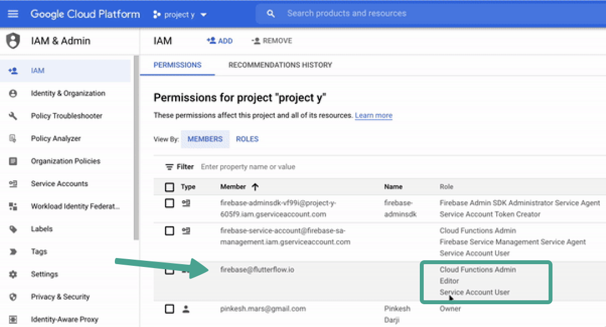

# Unable to Validate Firestore Schema

When trying to validate your Firestore Schema, you may encounter the error as seen in the image below:  

**Troubleshooting Steps:**

1. **Verify that you have Created a Firestore database**

    Ensure that you have already created a Firestore database in your Firebase project.

    

2. **Check the Database Mode**

    A database in Test Mode may not work properly for FlutterFlow integration.

    :::note 
    After creating the database in Test Mode, there is no direct visual option to switch to Production Mode. You need to update the Firebase security rules manually. However, if you deploy the rules from FlutterFlow, this step is handled automatically.
    :::

    **Steps to Update your Database Rules**:

      1. Go to your Firebase project.
      2. Select **Cloud Firestore**.
      3. Navigate to **Rules**.

      You will see something like this:

      

      Update the rules as needed.

      :::note 
      Ensure that you specify the correct `rules_version` and verify your configuration.
      :::

      

      4. Click **Publish** to apply the changes.

3. Assign the necessary permissions to `firebase@flutterflow.io`

    You must grant the required cloud permissions to `firebase@flutterflow.io`:

    - **Editor**
    - **Cloud Functions Admin**
    - **Service Account**

    In the Firebase Console:

      1. Open your project.
      2. Go to **Project Settings** > **Users & Permissions**.
      3. Confirm that the required roles are assigned to `firebase@flutterflow.io`.

      If you don't see these roles assigned, you need to complete this step:

      

4. Ensure you have at least one collection created in FlutterFlow

    In FlutterFlow, select the **Firestore** tab from the left menu. If no collections are listed, create at least one collection.

    

5. **Confirm that your collections have documents**

    Use FlutterFlow's CMS to verify that your collections contain at least one document:

    - Select **Manage Content**.
    - Check each collection to confirm that data exists.

    If no documents exist, add at least one:

    

    

6. **Deploy Firestore rules from FlutterFlow**

    In your FlutterFlow project:

      1. Select **Firestore** > **Settings**.
      2. Scroll down to **Firestore Rules**.
      3. Select **Deploy** (or **Redeploy** if needed).

      

