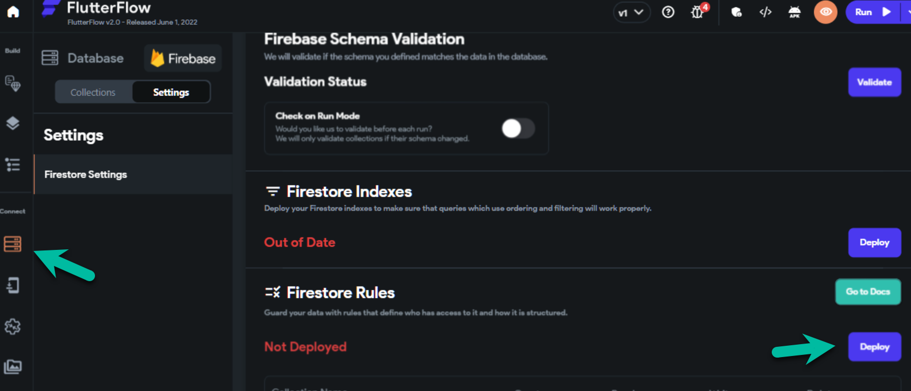
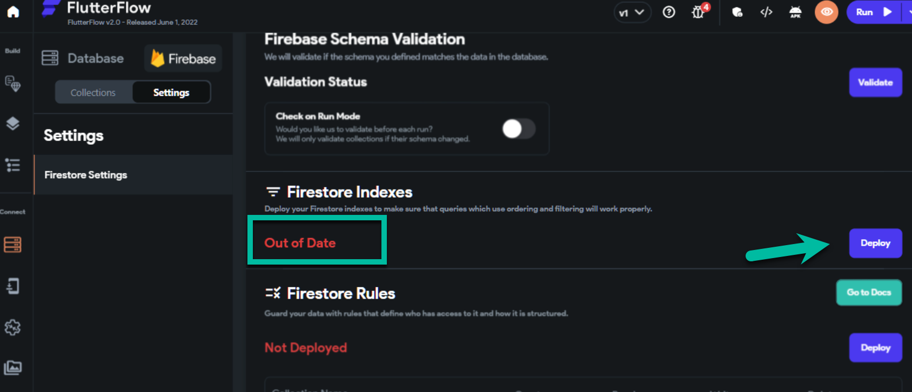
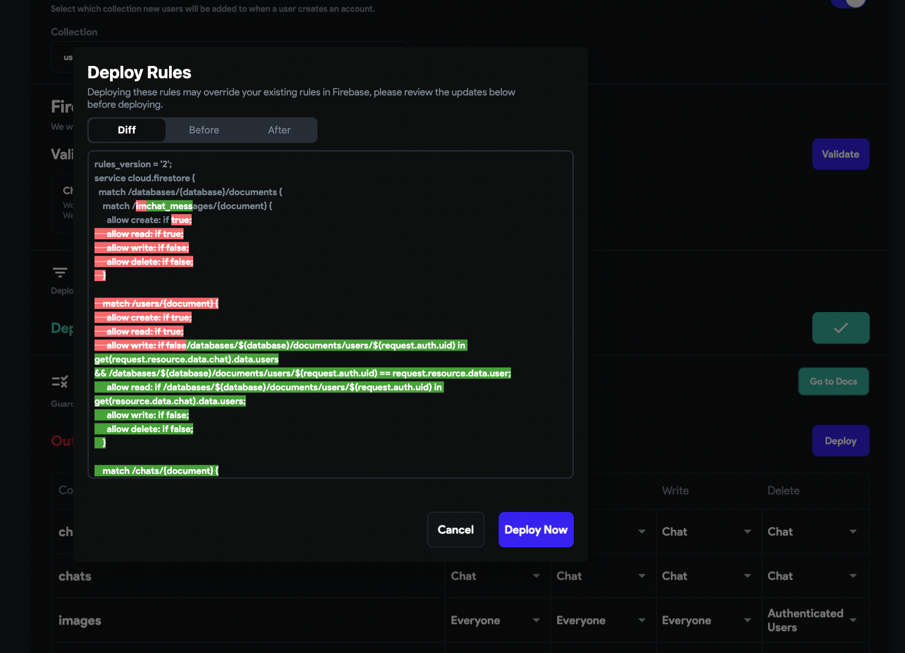

# Updating Firestore Security Rules

Most backend issues are generated by the misconfiguration of the Firestore Security Rules. These backend issues may include Grey Screen errors, Infinite Loading screen, Firestore record creating error, Data mismatch errors, etc.

To solve these issues, the Firestore rules have to be updated, for which you can follow the given series of steps:

- **Update Your Firestore Rules**

    From within your FlutterFlow project, select **Firestore** &gt; **Settings** &gt; Scroll down to **Firestore Rules** &gt; select **Deploy**/**Redploy**.

    

- **Update Firestore Indexes**

    The next step is to see if the Firestore Rules and Indexes are **Out of Date** or **Not Deployed** (as shown in the image below). If yes, click on the blue **Deploy** button to push the latest rules. 

    

    After clicking on the **Deploy** button, a confirmation dialog would be shown, highlighting the changes in the rules that are being made from the deployment. 

    This compares the existing rules in Firestore and highlights what changes are being made in the Firestore rules. These changes are required when a new collection is created or is been edited or if the rules are Out of Date.

    

    You can review the changes, and then you can click on the **Deploy Now** button. An orange loading indicator would be shown, which means that the rules are getting deployed (This step usually finishes within less than a minute, and the loading indicator is replaced with a Green Checkbox button).

- **Validate the Firestore Schema**

    After completing the steps above, validate the Firestore schema by clicking on the blue **Validate** button. This ensures that everything is configured correctly and the Firestore collection schema matches with the Collection schema configured in FlutterFlow.

    