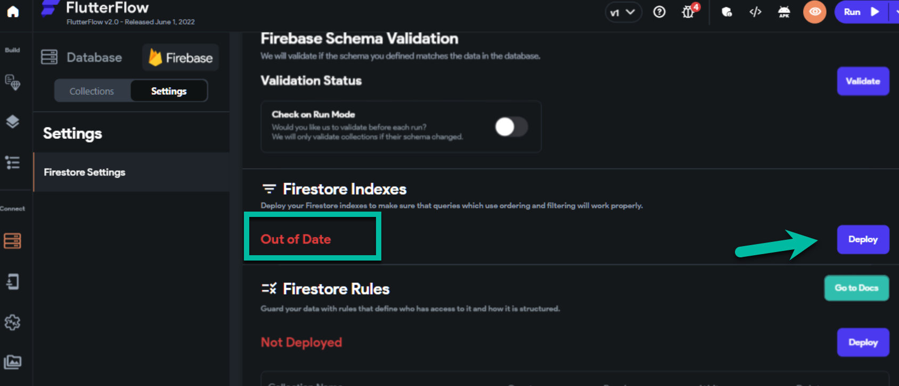
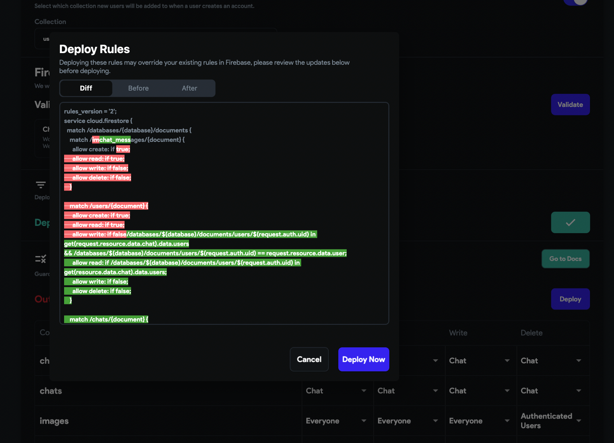

---
keywords:
  - rules
  - firestore
  - updating
slug: /troubleshooting/firebase/updating-firestore-security-rules
title: Updating Firestore Security Rules
description: >-
  Most backend issues are generated by the misconfiguration of the Firestore
  Security Rules.
tags:
  - FlutterFlow
  - Troubleshooting
  - Firebase
last_verified: 2026-09-02
---
# Updating Firestore Security Rules

Firestore Security Rules are one possible cause of permission-denied reads or writes. Gray screens, loading states, and data mismatches can also come from indexes, null/type errors, invalid queries, connectivity, or rendering, so start with the exact runtime error.

To solve these issues, the Firestore rules have to be updated, for which you can follow the given series of steps:

- **Update Your Firestore Rules**

    From within your FlutterFlow project, select **Firestore** &gt; **Settings** &gt; Scroll down to **Firestore Rules** &gt; select **Deploy**/**Redploy**.

    

- **Update Firestore Indexes**

    The next step is to see if the Firestore Rules and Indexes are **Out of Date** or **Not Deployed** (as shown in the image below). If yes, click on the blue **Deploy** button to push the latest rules.

    

    After clicking on the **Deploy** button, a confirmation dialog would be shown, highlighting the changes in the rules that are being made from the deployment.

    This compares the existing rules in Firestore and highlights what changes are being made in the Firestore rules. These changes are required when a new collection is created or is been edited or if the rules are Out of Date.

    

    Review the diff before selecting **Deploy Now**. Test owner, non-owner, signed-out, create, update, and delete cases first when possible. Never deploy an allow-all or extended test-mode rule as a production troubleshooting shortcut.

- **Validate the Firestore Schema**

    After completing the steps above, validate the Firestore schema by clicking on the blue **Validate** button. This ensures that everything is configured correctly and the Firestore collection schema matches with the Collection schema configured in FlutterFlow.

    

Rules are not filters: a query must be provably allowed for its potential result set. Server Admin SDK calls bypass Firestore Security Rules and must be controlled with IAM and application authorization.

## Related documentation

See [Client Access to Firestore Expired](/troubleshooting/firebase/client-access-to-firestore-expired) for a related FlutterFlow workflow.
