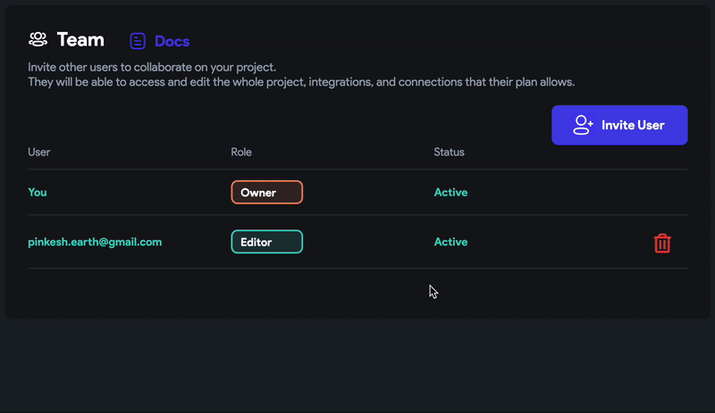

# Transfer a Project to Another User in FlutterFlow

You can easily transfer ownership of a FlutterFlow project to another user on your team. This is useful when you’re handing off a project or want someone else to manage it going forward.

:::warning
**This action cannot be undone.**  
Once transferred, only the new project owner can initiate a transfer back to you.
:::

:::info[Prerequisites]
- The person you want to transfer the project to **must already be added** to the project.
- Their status in the **Team** section must be **Active** (i.e., not pending).
- You must be the **current project owner**.
:::

Follow the steps belpw to transfer project ownership:

    1. Open your project in FlutterFlow.

    2. From the left navigation menu, go to **Settings & Integrations**.

    3. Under the **Project Setup** section, click **Team**.

    4. Locate the team member you want to make the new owner.

    5. Click their current **role** (e.g., Editor).

    6. In the popup that appears, confirm the transfer by selecting **Yes**.

    

    **After the Transfer:**

        - You will become a **collaborator** on the project with the same access level you had before, minus ownership rights.
        - The new owner can now manage billing, collaborators, and future transfers.

