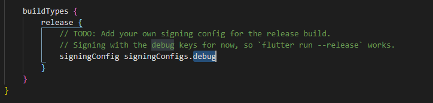
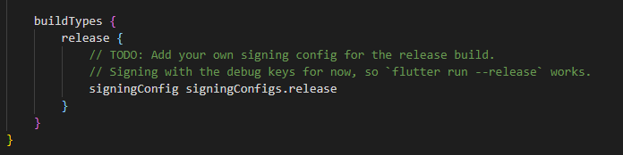

# You uploaded an APK or Android App Bundle that was signed in debug mode.


Unsure about the type of error in your project? Refer to this article to learn how to identify Codemagic errors.

## What does this error mean?

You need to sign your APK or Android App Bundle in **release mode** instead of debug mode.

## Full error message

```
You uploaded an APK or Android App Bundle that was signed in debug mode. You need to sign your APK or Android App Bundle in release mode
```

## How to resolve this issue

You'll need to modify your android/app level build.gradle file and replace `debug` with `release`.​ 

Follow the steps below: 

- Step 1: Find the debug keyword under buildTypes in android/app/builld.gradle in your project folder



- Step 2: Replace the debug keyword with release and then save the file


## The issue was not resolved

If this does not resolve the issue, contact FlutterFlow Support at support@flutterflow.io