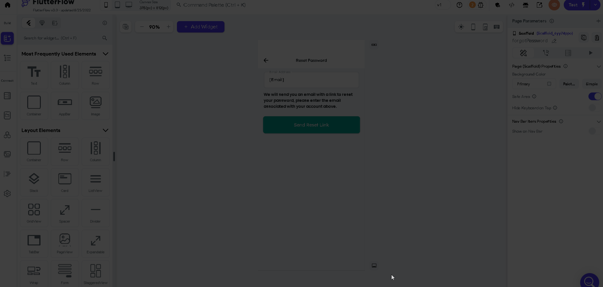

:::info[Prerequisites]

Before you begin, ensure that:

- You have access to your FlutterFlow project.
- You can open and edit your **pubspec.yaml** file.
- You are familiar with your build environment (FlutterFlow, GitHub, or IDE).
:::

When building your app, you may encounter the following error:

```js
Codemagic Deploy Output Failed Step: Generate Launch Icon Could not find package "flutter_launcher_icons". Did you forget to add a dependency? pub finished with exit code 65. Build failed: Step 5 script 'Generate Launch Icon' exited with status code 65. 
```

This error means that the required **flutter_launcher_icons** package is missing or not properly configured.

If the error is caused by fix build error in FlutterFlow then do the following:

- **Clear and Reset App Assets**

    - Navigate to **Settings and Integrations > App Assets** inside FlutterFlow.
    - If the **Splash Screen** and **Launcher Icon** are already set:
        - Clear both.
        - Re-upload the launcher icons.

    


If the error is caused by fix build error in GitHub Deployment then do the following:

**Add flutter_launcher_icons package to pubspec.yaml**

Open your **pubspec.yaml** file and add the following under **dev_dependencies**:

    ```yaml
    dev_dependencies:
        flutter_launcher_icons: "^0.10.0"

    flutter_icons:
    android: true
    ios: true
    image_path_ios: "assets/images/launcher/ios.png"
    image_path_android: "assets/images/launcher/android.png"
    ```

    Explanation:

        - flutter_launcher_icons: "^0.10.0": Specifies the version of the launcher icons package.
        - image_path_ios: Path to the iOS launcher icon image.
        - image_path_android: Path to the Android launcher icon image.
    Ensure your image files exist at the correct paths.

    After adding the package, run the following commands in your terminal or IDE:

    ```bash
    flutter pub get
    flutter pub run flutter_launcher_icons:main
    flutter run
    ```

        - flutter pub get: Fetches all required packages.
        - flutter pub run flutter_launcher_icons:main: Generates launcher icons.
        - flutter run: Builds and runs the app.

    If this does not resolve the issue, contact FlutterFlow Support at support@flutterflow.io for further assistance.


