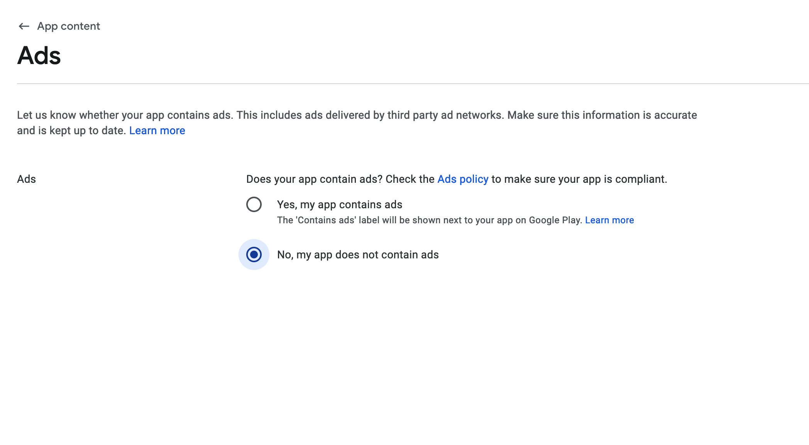

# Declare Advertising ID for Android 13+ in Play Console

:::info[Prerequisites]
- You are submitting your app to Google Play targeting Android 13 (API 33) or above.
:::

When uploading your app to Google Play, you may encounter this error:

```js
Google Play failed to upload artefacts. Your app targets Android 13 (API 33) or above. You must declare the use of advertising ID in Play Console.: {    "error": {        "code": 400,        "message": "Your app targets Android 13 (API 33) or above. You must declare the use of advertising ID in Play Console.",        "status": "INVALID_ARGUMENT"    }}
```

Google Play now requires developers targeting Android 13 (API 33) or above to explicitly declare if their app uses the **Advertising ID**.

You may see this error if:

    - You didn't complete the advertising ID declaration in the Play Console.
    - Your app configuration suggests ad usage but you have not declared it.
    - Your declaration is incomplete or missing required details.

Follow the steps below to fix this error:

Step 1 — Open App Content Section in Play Console

    - Log into your **Google Play Console**.
    - Navigate to your app's **App Content** section.

    

Step 2 — Declare Advertising ID Usage

    - If your app **does not contain ads**, select **No** under the "Advertising ID" section.

    

    - If your app **contains ads**, select **Yes** and provide the necessary details about how ads are used.

    This Declaration is important because Google Play uses this information to:

        - Inform users about your app’s data collection practices.
        - Ensure compliance with privacy policies.
        - Prevent build upload failures.


If the issue persists after following these steps, please contact FlutterFlow Support via Chat or email at [support@flutterflow.io](mailto:support@flutterflow.io).

