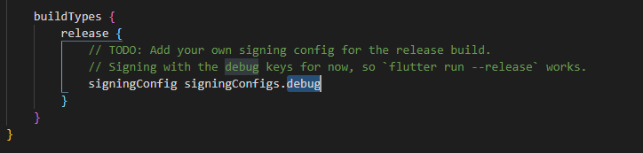
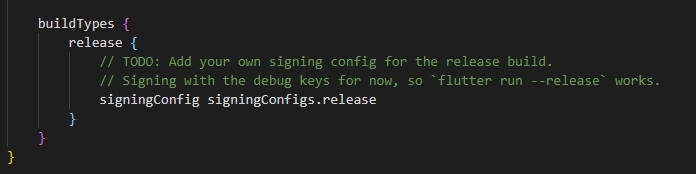

# Google Play Store Deployment Issues

You uploaded an APK or Android App Bundle that was signed in debug mode. You need to sign your APK or Android App Bundle in release mode

You'll need to modify your android/app-level build.gradle file and replace `debug` with `release`. You'll need to replace the debug keyword with the release.

Here are the instructions on how to do this:

- Find the debug keyword under buildTypes in android/app/builld.gradle in your project folder.

- Replace the debug keyword with release and then save the file.

​

Please make sure that you fill out all the information in the play store including the store listing information and the setup information.

​