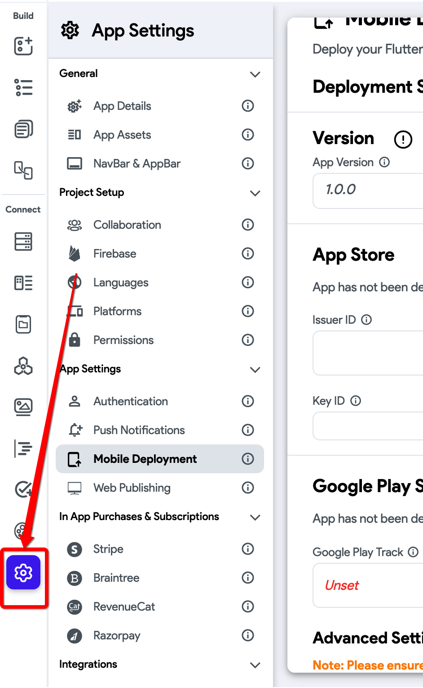
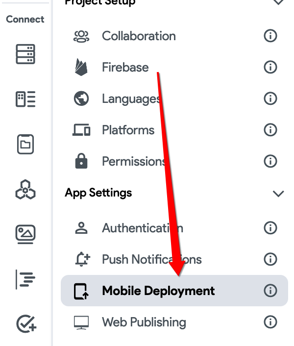
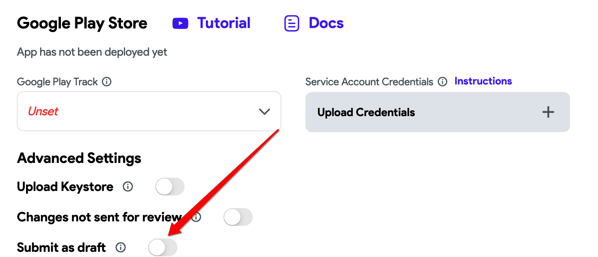

# Only Releases with Status Draft may be Created on Draft App

Not sure which type of Codemagic error you're running into? 
Check out this article on how to identify your Codemagic error.


## Full Error Message

```
Google Play failed to upload artifacts. Only releases with status draft may be created on draft app.: {    "error": {        "code": 400,        "message": "Only releases with status draft may be created on draft app.",        "status": "INVALID_ARGUMENT"    } }
```

## Most Common Error

One of the most common causes of a publishing error when deploying to the Google Play Store is when you haven't filled out all the necessary information in the Play Store before deploying the application.

### How To Resolve This Issue

Please make sure that you fill out all the information in the Play Store including the store listing information and the setup information. Then, please follow the steps outlined below:

#### Step 1

On the projects dashboard, navigate to the **settings and integrations** section.​



#### Step 2

Navigate to the **Mobile Deployment** section.​



### Step 3

Under the Google Play Store Deployment section, toggle on **submit as draft**.


