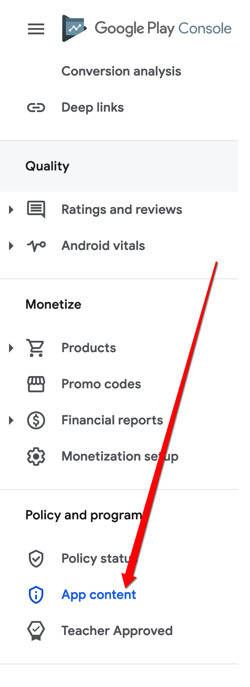

# Your App Targets Android 13 (API 33) or Above. You Must Declare the Use of Advertising ID in the Play Console

## Full Error Message 

```
Google Play failed to upload artefacts. Your app targets Android 13 (API 33) or above. You must declare the use of advertising ID in Play Console.: {    "error": {        "code": 400,        "message": "Your app targets Android 13 (API 33) or above. You must declare the use of advertising ID in Play Console.",        "status": "INVALID_ARGUMENT"    }}
```
## What does this error mean?

While submitting application to the Google Play Store, sometimes you may get an error that reads "Advertisement ID Error". This error can happen when you do not have advertisements in your project but it was declared that your project has advertisement IDs or if your application has advertisement IDs, they were not correctly declared and insufficient information was provided in the Google Play Store.

## What Happens When You See the Error?

When you see this error, you will have to submit a completely new release for the application with advertisement ID already included, properly declared and sufficient information provided in the store listing.

## What Should I Do To Avoid This Error?

To avoid this error, you should always make sure that you are providing valid and sufficient information about advertising IDs in the store listing. You must provide complete details about the advertisement that includes - if there are ads appearing, if it is an in-app purchase or if it is some other type of ad. If the application does not have any advertisement, then this should also be declared properly in the store listing.


## How to resolve this issue?

### STEP 1

In your Google Developer Console, you have to access, the **App Content** section​



### STEP 2

If your application does not contain any advertisements, you would only have to select '`No`' ​


And if your application contains advertisements, you would have to select '`Yes`' in that case.

## The issue was not resolved
If the codemagic error still persists after following the outlined steps, please report this issue to support via Chat or Email at support@flutterflow.io.