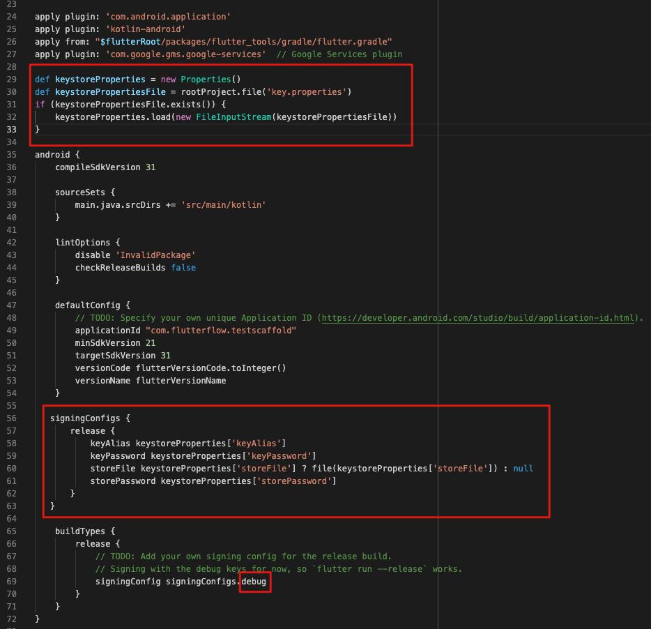

It means the bundle is signed with a keystore that doesn’t match the one Google expects.

---

## Why This Happens

This issue usually occurs when:
- The wrong keystore file was used during signing.
- You uploaded a bundle signed in debug mode.
- The app was previously deployed using a different keystore, and the current one doesn't match the expected SHA1.

---

## How To Fix It

### 1. Use the Correct Keystore File

Verify that the **correct keystore file** (the one used when first publishing the app) is being used to sign your app.  
If you're unsure, contact support at [support@flutterflow.io](mailto:support@flutterflow.io).

To generate a new keystore, use the following command:

```bash
keytool -genkey -v -keystore ~/upload-keystore.jks -keyalg RSA -keysize 2048 -validity 10000 -alias upload
```

> ⚠️ **If the original keystore has been lost and the app is already published, contact [Google Play Support](https://support.google.com/googleplay/android-developer) for recovery options.**

---

### 2. Verify `build.gradle` Is Properly Configured

Ensure your project’s `build.gradle` file is updated according to the [Google Play signing documentation](https://developer.android.com/studio/publish/app-signing).

---

### 3. Build in Release Mode

Make sure you’re submitting a **release build** and not a debug version.

- Debug builds are not optimized for production and use a debug keystore.
- Check your build mode and switch to **Release Mode** before uploading.


