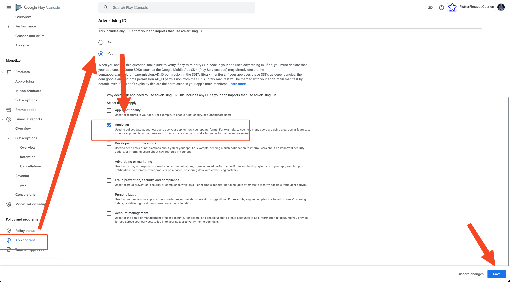

# Fix Advertising ID Declaration Error on Google Play

This error typically occurs when deploying your app through the Google Play Console. It indicates a mismatch between your app’s permissions and your Advertising ID declaration.

## Problem

You may encounter the following error:

```text
This release includes the com.google.android.gms.permission.AD_ID permission but your declaration on Play Console says your app doesn't use advertising ID. You must update your advertising ID declaration.
```


This issue can appear even if your app does not contain advertising content, especially when using libraries like Google Analytics that internally reference the advertising ID.

## Cause

The `com.google.android.gms.permission.AD_ID` permission is added automatically if you use services such as:

- Google Analytics
- Firebase
- Any SDK referencing the advertising ID

Even if you are not displaying ads, including these SDKs requires an explicit declaration in the Google Play Console.

## Solution

Follow these steps to update your Advertising ID declaration in the Play Console:

1. **Open the Google Play Console**  
   Navigate to your app project.

2. **Go to App Content**  
   From the left panel, scroll down to **Policy and Programs → App Content**.

3. **Update Advertising ID Declaration**  
   - Select **Advertising ID**
   - Click **Start**

   

4. **Answer Yes to Advertising ID Use**  
   Even if your app doesn't use ads directly, select **Yes** to indicate use of the AD_ID permission for analytics.

   

5. **Select Analytics**  
   Check the **Analytics** box under the section that asks how the Advertising ID is used.

6. **Save Changes**  
   Confirm and save the updated declaration.

## Notes

:::info
If you use Google Analytics or similar services, you must declare the use of the Advertising ID, even if ads are not shown in the app.
:::

## Troubleshooting

:::warning
If the error persists after updating the declaration, contact FlutterFlow support via chat or email at [support@flutterflow.io](mailto:support@flutterflow.io).
:::
