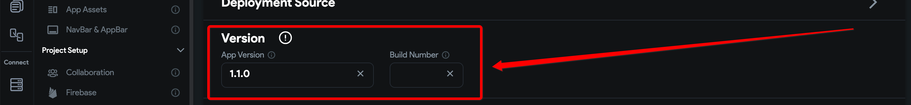

# APK Specifies a Version Code That Has Already Been Used

This error occurs when the version code of the APK being deployed has already been used in a previous release. To successfully publish to the Google Play Store, each APK must have a unique version code.

## Full Error Message

```text
Publishing failed :|Google Play failed to upload artefacts. APK specifies a version code that has already been used.: {"error": {"code": 403,"message": "APK specifies a version code that has already been used.","status": "PERMISSION_DENIED"}}
```


## What Causes This Error?

This error means that the application build being uploaded uses a version code already published to Google Play. The version code must be updated before publishing a new build.

## 1. Deploying Directly From FlutterFlow

Navigate to:

**Settings and Integrations → Mobile Deployment**



- **App Version**: Sets the version name for the app (e.g., `1.0.0`). This is optional but required in some deployment cases.
- **Build Number**: Each deployment must use a unique build number. Increase this by 1 with each deployment. If left blank, FlutterFlow will auto-increment it.

After updating both the version and build number from the previous release, redeploy the app.

## 2. Deploying From GitHub

Follow these steps to update the version manually:

1. Open the `pubspec.yaml` file.
2. Locate the `version` line.
3. Update it using the format:  
   ```yaml
   version: 1.0.2+2
    ```
    The format is version_name+build_number.
4. Run the following command in the terminal:

    ```js
    flutter clean
    ```
5. Rebuild the app using your standard build command.
    Use the latest Flutter version when deploying from GitHub to avoid compatibility issues.

If the issue persists after updating both the version and build number, contact: support@flutterflow.io