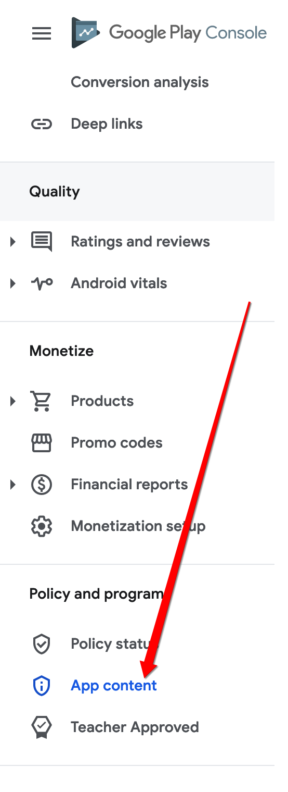
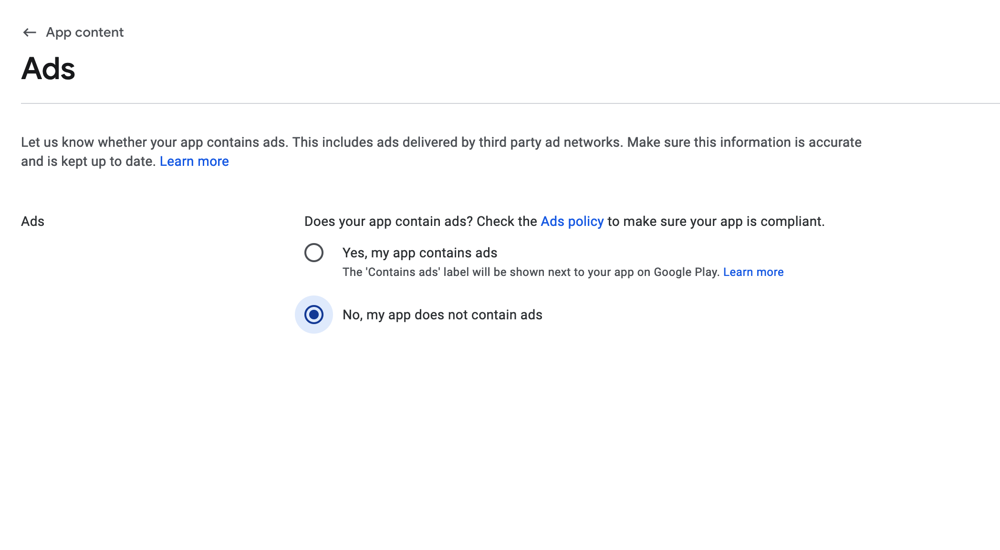

---
keywords:
  - api
  - android
  - error
slug: >-
  /troubleshooting/google-play-store-deployment/declare-advertising-id-android-13-play-console
title: Declare Advertising ID for Android 13+ in Play Console
description: >-
  If your app targets Android 13 (API 33) or higher, Google Play requires that
  you declare whether your app uses the Advertising ID .
tags:
  - FlutterFlow
  - Troubleshooting
  - Google Play Store Deployment
last_verified: 2026-09-02
---
# Declare Advertising ID for Android 13+ in Play Console

If your app targets Android 13 (API 33) or higher, Google Play requires that you declare whether your app uses the **Advertising ID**. Failing to do so will result in an upload error when submitting artifacts to the Play Console.

:::info[Prerequisites]
- Your app targets Android 13 (API 33) or above.
- The app is being submitted via the **Google Play Console**.
:::

When uploading your app to Google Play, you may encounter this error:

    ```js
    {
    "error": {
        "code": 400,
        "message": "Your app targets Android 13 (API 33) or above. You must declare the use of advertising ID in Play Console.",
        "status": "INVALID_ARGUMENT"
    }
    }
    ```
    This error occurs when the required declaration for the Advertising ID is missing, incomplete, or inconsistent with your app configuration.

    Google Play now requires developers targeting Android 13 (API 33) or above to explicitly declare if their app uses the **Advertising ID**.

    You may see this error if:

        - You didn't complete the advertising ID declaration in the Play Console.
        - Your app configuration suggests ad usage but you have not declared it.
        - Your declaration is incomplete or missing required details.

Follow the steps below to fix this error:

1. **Open App Content Section in Play Console:**

    - Log into your **Google Play Console**.
    - Navigate to your app's **App Content** section.

        

2. **Declare Advertising ID Usage**

    - Inspect the final merged manifest and every included SDK. If the app and its SDKs do not use the Advertising ID permission, select **No** and remove the permission if present.

    

    - If the final app uses the Advertising ID—including through an advertising or analytics SDK—select **Yes** and provide accurate usage details. “Contains ads” alone is not the technical test; the declaration must match the shipped manifest and behavior.

        This Declaration is important because Google Play uses this information to:

            - Inform users about your app’s data collection practices.
            - Ensure compliance with privacy policies.
            - Prevent build upload failures.


If the issue persists after following these steps, please contact FlutterFlow Support via Chat or email at [support@flutterflow.io](mailto:support@flutterflow.io).

## Related documentation

See [AdMob Ads Not Displaying in Google Play Testing](/troubleshooting/google-play-store-deployment/admob-ads-not-displaying-in-google-play-testing) for a related FlutterFlow workflow.
