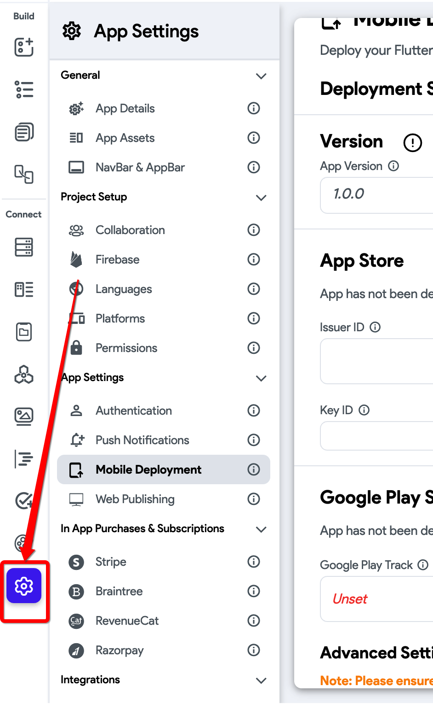

# Google Play Draft Release Error

When uploading an app to Google Play, you may encounter the following error:

```js
{
  "error": {
    "code": 400,
    "message": "Only releases with status draft may be created on draft app.",
    "status": "INVALID_ARGUMENT"
  }
}
```

This error occurs because Google Play only allows creating a Draft Release if your app is still marked as a draft in the Google Play Console. Typically, this means some required app information in the Play Console has not been completed, preventing full release submission.

:::info[Prerequisites]
- Your app is registered in the Google Play Console.
- Basic app details such as store listing and setup information are ready to be filled.
:::

This error indicates that Google Play only allows you to create a **Draft Release** when your app is still marked as a draft in your Google Play Console. You likely have missing or incomplete app information in Google Play preventing full release submission.


Follow these steps to fix the issue:

1. Complete All Required Information in Google Play Console

    - Log in to your **Google Play Console**.
    - Complete all mandatory sections under:
        - **App Content**
        - **Store Listing**
        - **Pricing & Distribution**
        - **Target Audience & Content Rating**

        Google Play requires all required information to be filled out before allowing full production releases.

2. **Enable "Submit As Draft" in FlutterFlow**

    After completing your app information, proceed as follows:

        - **Open Settings and Integrations**: From your FlutterFlow project dashboard, navigate to **Settings > Integrations**.

            

        - **Navigate to Mobile Deployment**: Select **Mobile Deployment**.

            

        - **Enable Submit As Draft**: Under **Google Play Store Deployment**, toggle on **Submit as Draft**.

            

            This allows you to submit your release as a draft until all Google Play requirements are fully satisfied.


If you’ve followed all steps and still encounter the issue, contact **FlutterFlow Support** via Chat or email at [support@flutterflow.io](mailto:support@flutterflow.io) for additional assistance.

