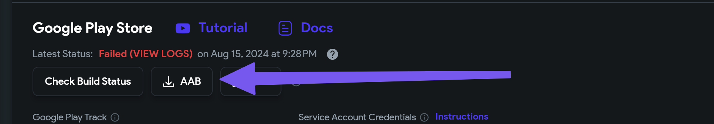

# Google Play Failed to Upload Artefacts

:::info[Prerequisites]
- Ensure your app’s `Package Name` in FlutterFlow matches the package name in Google Play Console.
- Firebase is configured in your project settings.
- Your Google Play Console account is active and accessible.
:::

When uploading your app to Google Play, you may encounter the following error:

```js
Google Play failed to upload artefacts. Package not found: com.flutterflow.appname.: {
  "error": {
    "code": 404,
    "message": "Package not found: com.flutterflow.appname.",
    "status": "NOT_FOUND"
  }
}
```

This error usually occurs in two scenarios:
- Deploying the app to Google Play for the first time.
- Changing the app’s `Package Name` in FlutterFlow without regenerating the Firebase configuration files.

**First Time Deployment to Google Play**

Follow these steps to upload your app for the first time:

    1. Generate your build in FlutterFlow and click the `AAB` button to download the build artifact.
    2. Log in to your **[Google Play Console](https://play.google.com/console)**.
    3. Navigate to your app project and upload the **AAB** file as a new release in the appropriate track (Internal, Closed, Open, or Production).
    4. After this initial upload, future deployments should proceed without this error.

        

**Updating Package Name and Regenerating Config Files**

If you have updated your app’s `Package Name` in FlutterFlow, follow these steps:
    1. Open your project in FlutterFlow.
    2. Navigate to **Settings** > **Firebase**.
    3. Click **Regenerate Config Files**.

        

    4. Enter the new `Package Name` and click Generate File to download the updated configuration files.

        

    5. Rebuild and redeploy your app to confirm the error is resolved.

If the error persists after completing these steps:
    - Verify the `Package Name` matches exactly between FlutterFlow and Google Play Console.
    - Confirm that Firebase configuration files have been updated correctly.
    - Contact FlutterFlow Support via Chat or email at support@flutterflow.io.

