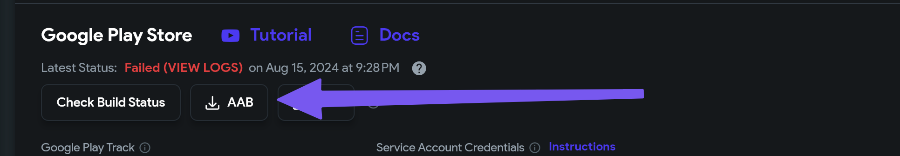
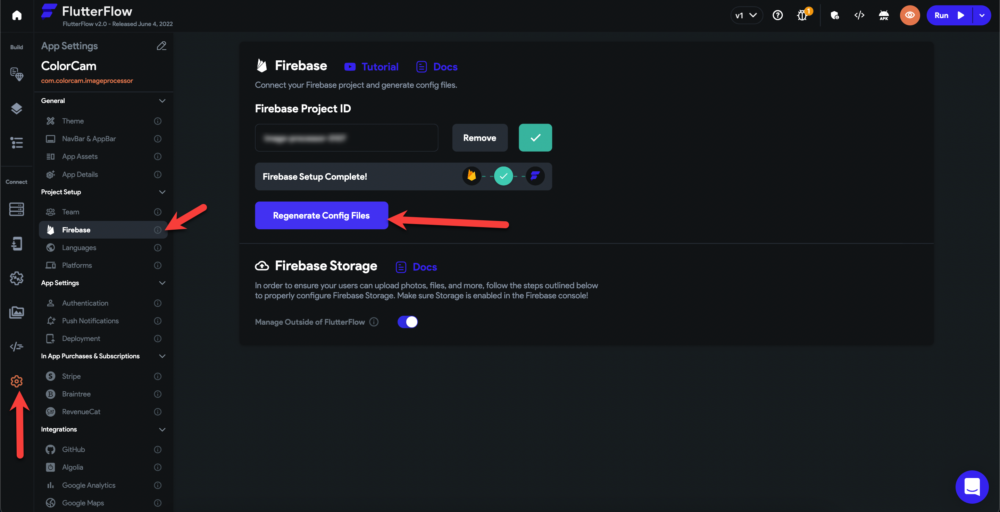
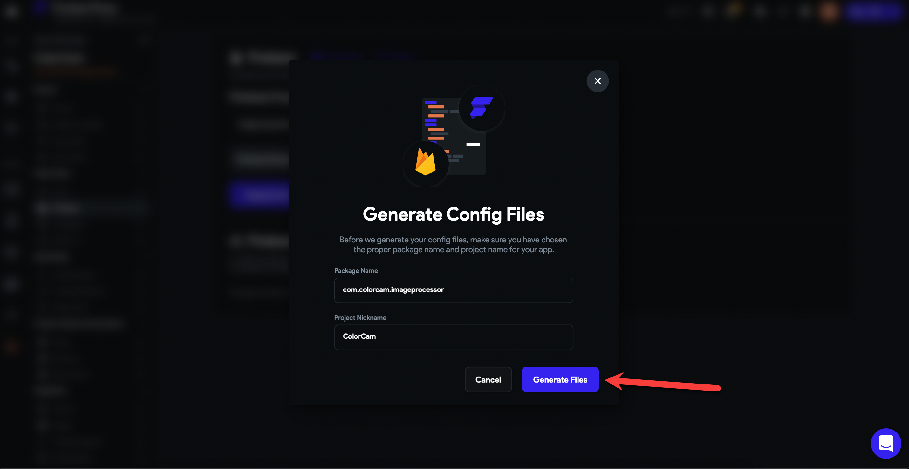

---
keywords:
  - firebase
  - error
  - package
slug: >-
  /troubleshooting/google-play-store-deployment/google-play-failed-to-upload-artefacts-package
title: Google Play Failed to Upload Artefacts
description: >-
  - Ensure your app’s in FlutterFlow matches the package name in Google Play
  Console.
tags:
  - FlutterFlow
  - Troubleshooting
  - Google Play Store Deployment
last_verified: 2026-09-02
---
# Google Play Failed to Upload Artefacts

:::info[Prerequisites]
- Ensure your app’s `Package Name` in FlutterFlow matches the package name in Google Play Console.
- Firebase is configured in your project settings.
- Your Google Play Console account is active and accessible.
:::

When uploading your app to Google Play, you may encounter the following error:

```js
Google Play failed to upload artefacts. Package not found: com.flutterflow.appname.: {
  "error": {
    "code": 404,
    "message": "Package not found: com.flutterflow.appname.",
    "status": "NOT_FOUND"
  }
}
```

This error usually means the Play Developer API cannot find that exact package in the authorized Play account, the app has not received its required first manual upload/setup, or the service account lacks access to the app. Firebase config can break app services, but it does not create or rename a Play listing.

**First Time Deployment to Google Play**

Follow these steps to upload your app for the first time:

    1. Generate your build in FlutterFlow and click the `AAB` button to download the build artifact.
    2. Log in to your **[Google Play Console](https://play.google.com/console)**.
    3. Navigate to your app project and upload the **AAB** file as a new release in the appropriate track (Internal, Closed, Open, or Production).
    4. After this initial upload, future deployments should proceed without this error.

        

**Updating Package Name and Regenerating Config Files**

If you changed the package name before the first release, follow these steps:
    1. Open your project in FlutterFlow.
    2. Navigate to **Settings** > **Firebase**.
    3. Click **Regenerate Config Files**.

        

    4. Enter the new `Package Name` and click Generate File to download the updated configuration files.

        

    5. Rebuild and redeploy your app to confirm the error is resolved.

An existing Google Play app's package name is immutable. To update that listing, restore its original package name and signing lineage; a different package name requires a separate app listing and does not update existing users.

If the error persists after completing these steps:
    - Verify the `Package Name` matches exactly between FlutterFlow and Google Play Console.
    - Confirm that Firebase configuration files have been updated correctly.
    - Contact FlutterFlow Support via Chat or email at support@flutterflow.io.

## Related documentation

See [AdMob Ads Not Displaying in Google Play Testing](/troubleshooting/google-play-store-deployment/admob-ads-not-displaying-in-google-play-testing) for a related FlutterFlow workflow.
