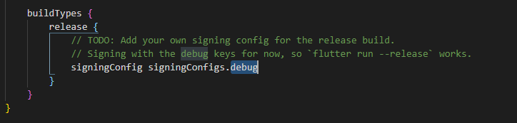
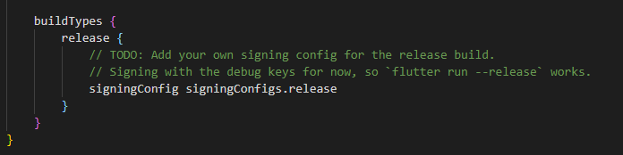

---
keywords:
  - deployment
  - debug
  - android
slug: >-
  /troubleshooting/google-play-store-deployment/google-play-store-debug-signing-error
title: Google Play Store Debug Signing Error
description: >-
  When uploading your Android App Bundle (AAB) or APK to Google Play, you might
  encounter this error: This error indicates the app must be signed with a
  release key before uploading.
tags:
  - FlutterFlow
  - Troubleshooting
  - Google Play Store Deployment
last_verified: 2026-09-02
---
# Google Play Store Debug Signing Error

When uploading your Android App Bundle (AAB) or APK to Google Play, you might encounter this error:

```text
You uploaded an APK or Android App Bundle that was signed in debug mode. You need to sign your APK or Android App Bundle in release mode
```
This error indicates the app must be signed with a release key before uploading.

:::info[Prerequisites]
- Access to the Android project files.
- Familiarity with editing Gradle build files.
:::

**Steps to Fix Debug Signing Error:**
    1. Generate a release AAB through FlutterFlow's supported store-deployment or release-build workflow.
    2. For exported code, configure a separate `release` signing configuration and reference it from the release build type. Do not rename the debug build type or point release signing at the debug keystore.
    3. Keep the keystore, passwords, service-account JSON, and populated signing properties out of Git. Back up the release/upload key securely and preserve the existing app's signing lineage.

        

    4. Build the release AAB and verify its certificate before uploading.

        

        :::note
        Make sure that you fill out all the information in the play store including the store listing information and the setup information.
        :::


​

## Related documentation

See [AdMob Ads Not Displaying in Google Play Testing](/troubleshooting/google-play-store-deployment/admob-ads-not-displaying-in-google-play-testing) for a related FlutterFlow workflow.
