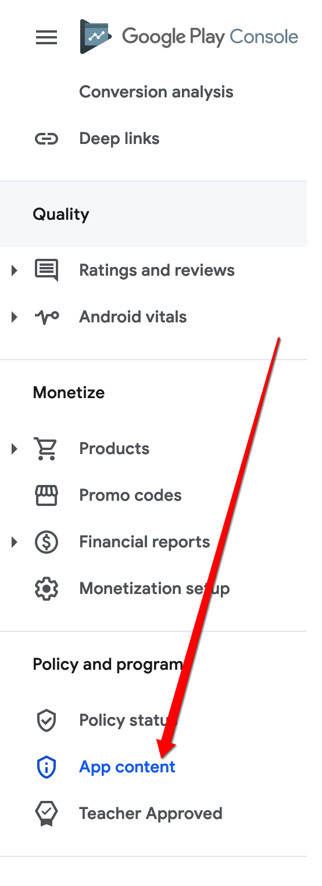
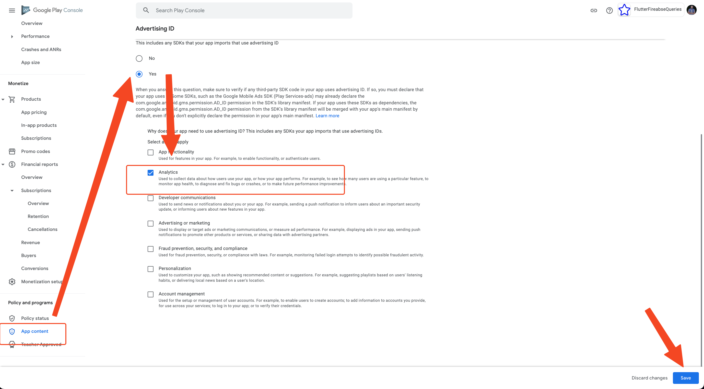

# Play Store AD_ID Permission Error

You may see this error when trying to deploy your app through the Google Play Store:

   ```text
   This release includes the com.google.android.gms.permission.AD_ID permission but your declaration on Play Console says your app doesn't use advertising ID. You must update your advertising ID declaration.
   ```
:::info[Prerequisites]
- Ensure your app is connected to the Google Play Console.
- Make sure you have access to the App Content section in the Play Console.
:::

Even if your app does not use ads, this error can occur if your project includes services like **Google Analytics**, which also uses the **AD_ID** permission.

By default, **Google Analytics** and other libraries may include the `com.google.android.gms.permission.AD_ID`, triggering this Play Console warning.

To resolve the issue:

1. **Go to Google Play Console**
   - Open your app project.
   - In the left-side panel, scroll to **Policy & programs > App content**.

2. **Update Advertising ID Declaration**
   - In the **App content** section, find and click on **Advertising ID**.
   - Click **Start** to begin the configuration.

   

3. **Select "Yes"**
   - Even if you are not using ads, choose **Yes** for the AD_ID usage.
   - Select **Analytics** as the reason for usage.

   

4. **Save the Changes**
   - Scroll to the bottom and click **Save**.
