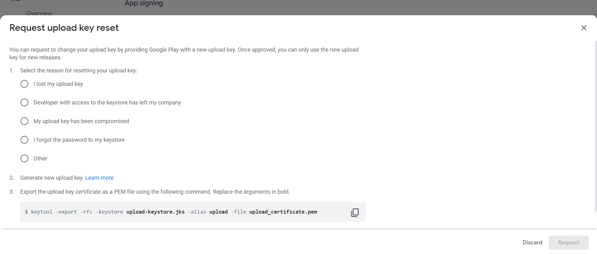
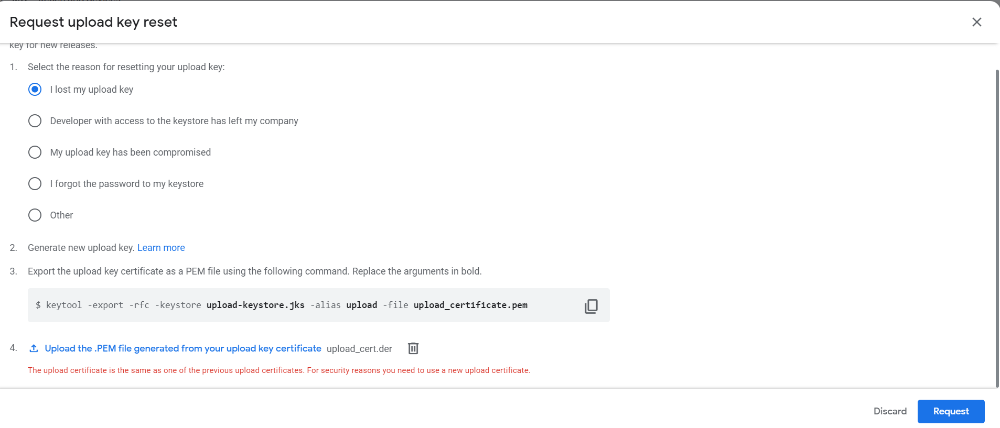
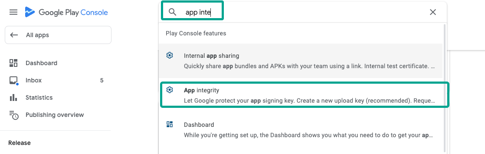
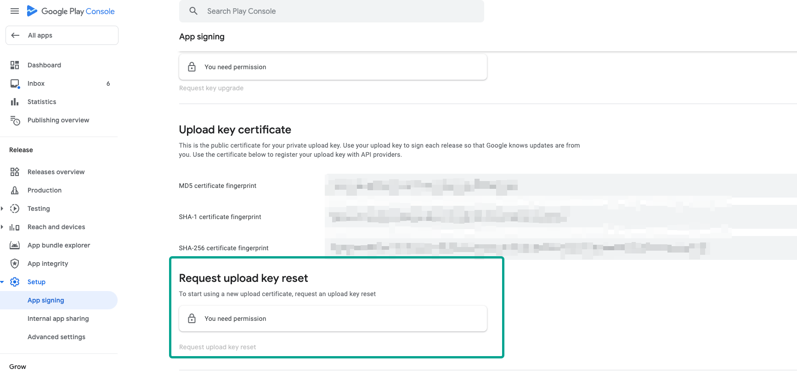
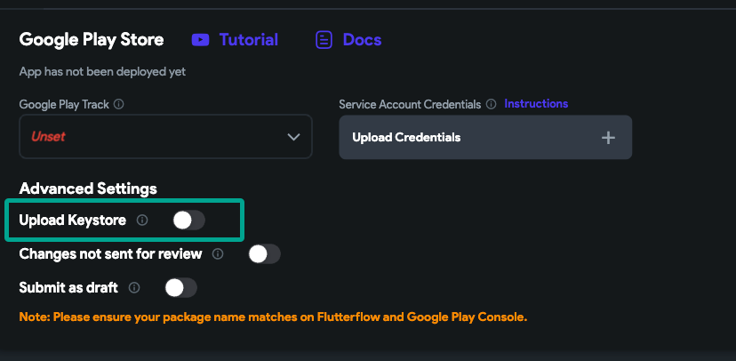
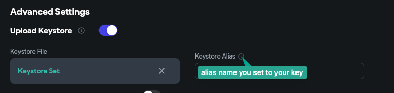
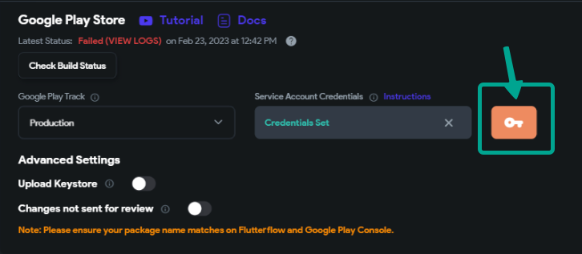

# Uploading a Keystore to FlutterFlow for an Existing Google Play App

## Introduction

Publishing an updated version of your app using FlutterFlow can be a challenging task, especially when the app was initially published on Google Play using another platform.

This guide walks you through the process of obtaining or resetting keys from Google Play, creating a new keystore on your local machine, uploading it to FlutterFlow, and successfully deploying the app to your existing Google Play project.

If you run into any roadblocks, we recommend reaching out to Google Play support or FlutterFlow Support for further assistance.





## Step 1: Create a New Keystore

Open your command line and enter:
```
keytool -genkeypair -alias allyou -keyalg RSA -keysize 2048 -validity 10000 -keystore allyou.keystore
```

This creates `allyou.keystore` with an RSA key, a key size of 2048 bits, and a 10,000-day validity.

## Step 2: Export the PEM Public Key

Then run:
```
keytool -export -rfc -keystore allyou.keystore -alias allyou -file allyou.pem
```

This exports the public key to `allyou.pem`.

## Step 3: Submit the PEM Key to Google Play

Log in to Google Play Console and submit the `allyou.pem` file through the App Signing section.

## Step 4: Wait for Approval

Approval times vary, so check back regularly in your Google Play Console.

## Step 5: Deploy to Google Play Using the Keystore

Once approved, use your `allyou.keystore` when uploading the app via FlutterFlow.

---

## Requesting a New Upload Key (If Necessary)

If your original upload key is lost or compromised, you can request a new one.

1. Log into Google Play Console
2. Go to **Setup > App Integrity**
3. Select **Request upload key reset**
4. Follow on-screen instructions




> **Note**: Only users with proper permissions can request this.

Once Google approves, it takes about 48 hours to receive your new key.

## After Receiving the New Upload Key

You’ll typically receive a `.jks` or `.p12` file.

### 1. Verify the Key

Run:
```
keytool -list -v -keystore path/to/your_new_key.jks
```

### 2. Convert `.p12` to `.jks` (if needed)

```
keytool -importkeystore -srckeystore your-key.p12 -srcstoretype pkcs12 -destkeystore your-key.jks -deststoretype JKS
```

### 3. Upload to FlutterFlow

Upload the `.jks` in the **Deploy > Android Settings** section in FlutterFlow. Provide the correct alias and passwords.




Before releasing, do a test build to ensure everything works.



## Conclusion

Managing keystores is essential in app publishing. Always keep backups and record all passwords securely. If you lose your keystore, the update process becomes significantly more difficult.

Contact FlutterFlow or Google Play Support if needed.
