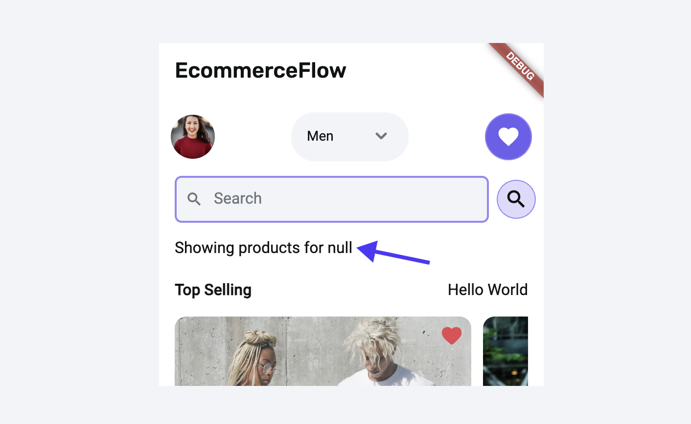
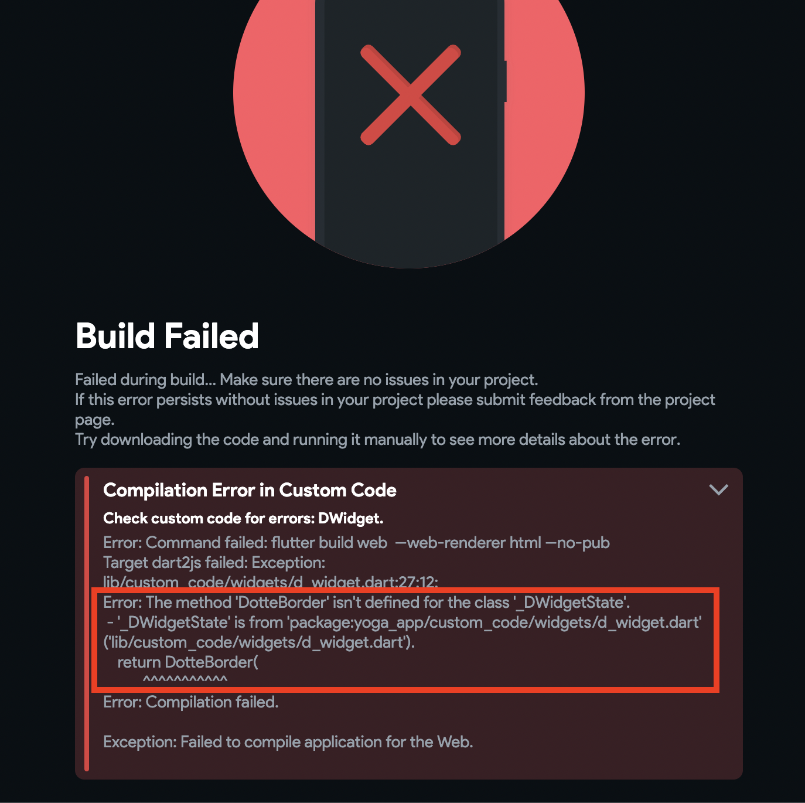

# Troubleshooting Guide

This is a general troubleshooting guide for any issues that occur within FlutterFlow projects.

## Detecting issues

We've improved our issue detection capabilities and added features to provide clearer insights into what might be causing these problems. Here are some options you can use to troubleshoot the issue.

### Using Debug Info panel (Test Mode)

The Debug info panel is a powerful tool that provides a real-time view of all the variables in your app along with their current values. This feature is particularly useful for developers who need to track the state of their apps without navigating through different parts of the project and diagnose issues efficiently.

It allows you to search for specific variables and filter them based on their type or nullability. By observing how variables change, you can pinpoint where unexpected values or behaviors are occurring and take appropriate action to resolve them.

To use the Debug info panel:

1. Run your app in the **Test mode**, and you'll see the **Debug info** panel on the left side.
2. As you interact with your app, the Debug info panel will update variable values in real time. You can monitor these changes to understand how different interactions affect the state of your app.

#### Example

Suppose you are working on an e-comm app, and while testing, you notice that the variable is unexpectedly set to `null`. This is causing the app to display incorrect information to the user.

Using the Debug Info panel, you can easily trace that the dropdown variable is set to `null` until the user changes the dropdown value. After identifying the root cause, you can make the necessary changes to ensure the variable is correctly initialized. Then, re-test the app to verify that it displays the correct information.

    <iframe 
        src="https://demo.arcade.software/TgIsoAjlnDiHaafypnpV?embed&show_copy_link=true"
        title=""
        style={{
            position: 'absolute',
            top: 0,
            left: 0,
            width: '100%',
            height: '100%',
            colorScheme: 'light'
        }}
        frameborder="0"
        loading="lazy"
        webkitAllowFullScreen
        mozAllowFullScreen
        allowFullScreen
        allow="clipboard-write">
    </iframe>

### Opening debug logs

To open the debug logs, run your app in Run/Test mode and select:

**For Google Chrome**

- **Windows**: F12 or Ctrl+Shift+J
- **Mac**: F12 or ⌘+Option+J

**For Safari**

Go to Preferences/Settings > Advanced and enable the "Show Develop menu". Then, use ⌘+Option+C to open the console.

This will open the console log, and any errors will be highlighted in red color.

    <iframe 
        src="https://demo.arcade.software/c0I844oLVtAR0e7YSbhC?embed&show_copy_link=true"
        title=""
        style={{
            position: 'absolute',
            top: 0,
            left: 0,
            width: '100%',
            height: '100%',
            colorScheme: 'light'
        }}
        frameborder="0"
        loading="lazy"
        webkitAllowFullScreen
        mozAllowFullScreen
        allowFullScreen
        allow="clipboard-write">
    </iframe>

### Desktop app's device logs

If you're using our Desktop App and running the app with a local run, you might encounter issues that are logged in the [device logs](../testing-deployment-publishing/running-your-app/local-run.md#access-device-logs-in-local-run). These logs can help you understand why something isn't working as expected.

For example, if a user enters a character instead of a numeric value for the product quantity, which is not allowed, the error will be logged in the device logs, highlighting the exact issue.

:::tip
If you're unsure about the meaning of an error message, you can copy and paste the entire error text into ChatGPT and ask for an explanation or solution.
:::

For this specific error, [we asked ChatGPT](https://chat.openai.com/share/77f3ceb5-6b2f-4f94-b85c-e01a1fce002a) to explain and guide us on fixing the issue, and the fix was super simple!

### Error popup

If you see a popup, open the red-colored section (click *Read More*), and at the bottom, you will see the exact widget or error causing the build or download failure.

Let's see a couple of examples of what you might encounter while building your app:

#### Example 1

Suppose you have a Text widget and added an action that is incomplete. When you try to download the project in such a situation, you might see the following:

To track down the error-causing widget in the widget tree, start reading the widget list (from top to bottom in a popup) and locate the widget using its child number. For example, when a widget is displayed as *Child 1*, it will be the first child of its previous widget (see the widget in a popup). And when it is shown as *Child 2,3*, and so on, it will be the sibling widget of *Child 1*.

If you have a practice of naming the widget, it will be straightforward to track it down (as we'll display the exact widget name). Here is how it looks:

:::info
To find out what caused the widget to fail, you can check errors in the [project issues](../intro/ff-ui/toolbar.md#project-issues).
:::

#### Example 2

Let's say you have added a custom widget that works fine. But while modifying it, you made some typo in the code, and now it shows this:

The second "**Error:"** line clearly mentions that there is some issue with a method name in a custom code.

## Runtime errors (Run mode-only notification)

Runtime errors in app development are errors that occur during the execution of the app. Unlike the errors that we display while you build the app, runtime errors occur while the app is running.

For instance, if Firestore security rules aren't properly configured, the app might run into permission issues at runtime, leading to failures in data retrieval or display. This kind of error might not be evident during app building but becomes apparent only when the app interacts with the Firestore database during actual operation.

We display such errors as *Run mode-only notification* in a snack bar. Here's what it might look like:

