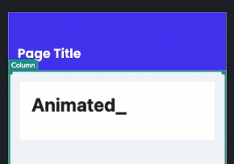
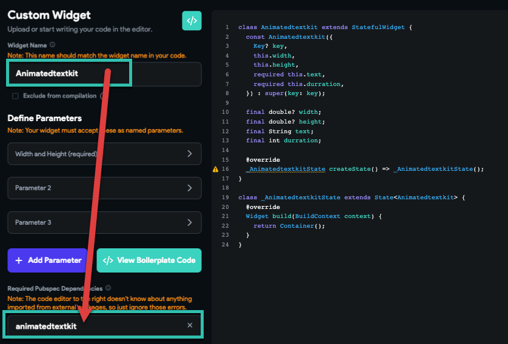
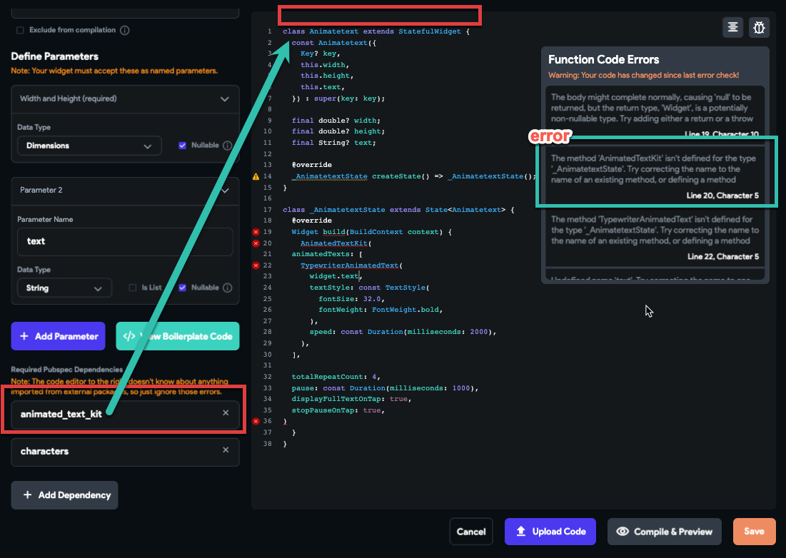
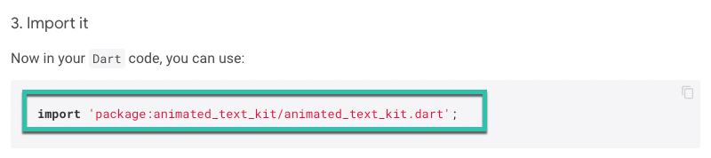
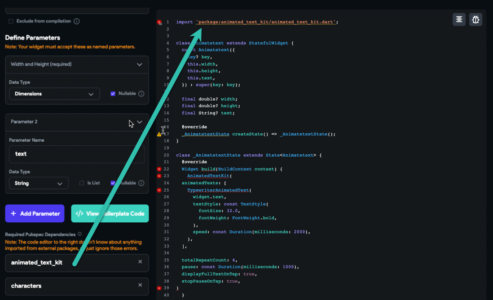
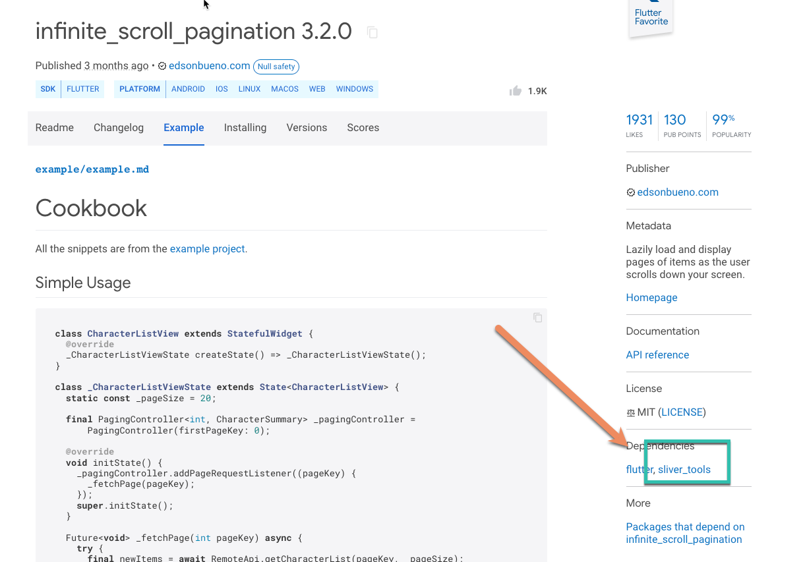
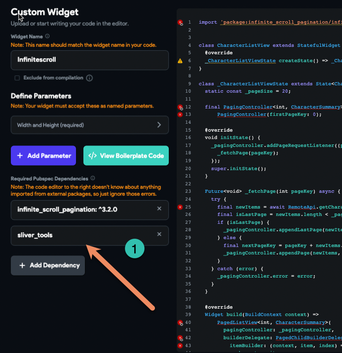
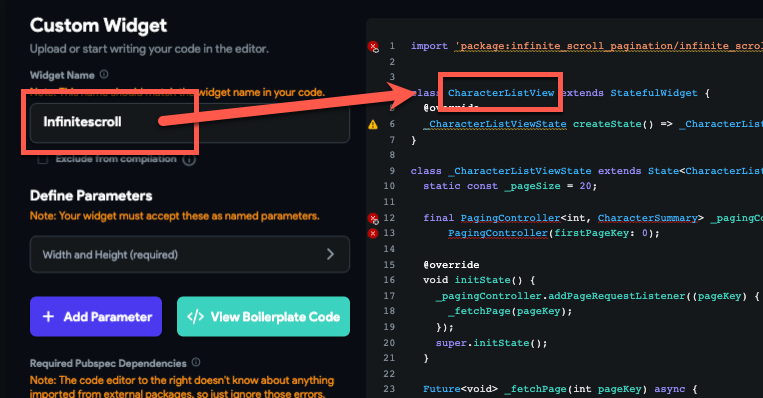
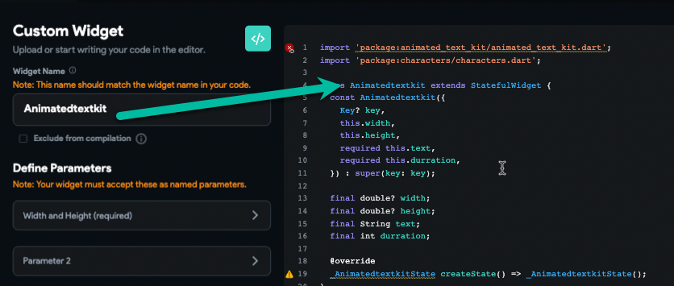

# Custom Widget Errors

This article demonstrates common errors and issues that may occur when creating a `Custom Widget` in FlutterFlow, along with steps to resolve them. In this example, an `Animated Text Widget` is used.



**Project URL:** [Animated Kit Widget Project](https://app.flutterflow.io/project/animated-kit-widget-fyqw6j)  

**Run Mode URL:** [Animated Kit Widget Run Mode](https://app.flutterflow.io/run/QP62FwanUTRs7O3HJzdo)

:::info[Prerequisites]
- A custom widget has been added to your project.
- Necessary packages have been added to **Custom Code > Packages**.
:::

:::tip[Best Practices Before Creating a Custom Widget]
- Set a unique name for the custom widget in the left panel `Side Widget` field.
- Start with the boilerplate code template provided by FlutterFlow. Copy it and modify your code from there.


:::


**Common Errors and Solutions:**

    - **Widget Name Conflicts with Package Name**

        A common issue is using a widget name that conflicts with the name of an imported package.

        Avoid generic or conflicting names like `main` or `widget`. Use unique widget names that do not overlap with package names.

        

        

        Avoid using generic or conflicting names like `main` or `widget`. Always use unique widget names that do not overlap with any package names.

    - **Missing Package Imports in Code**

        After adding an external package as a dependency, you must import it at the top of your custom widget code. Failure to do so results in errors such as:

        ```js
        The method 'AnimatedText' isn't defined...
        ```

        

        Here is how to fix this issue:

            - Visit the package page on **[pub.dev](https://pub.dev/)** and locate the import line in the package details section.
            - Copy and paste the correct import statement into your custom widget code.

                  
                


    - **Missing Indirect Dependencies**

        Some packages may rely on additional external packages. Ensure that all required dependencies are also imported in your code.

        

        In this example, the package depends on another package named `silver_tools`, which must also be imported. Always review the dependency chain for any external packages you add.

        

        
    - **Widget Name Mismatch Between UI and Code**

        A mismatch between the widget name in FlutterFlow and the class name in your code will cause compilation errors.

        Incorrect example:

        

        Corrected version with matching names:

        

        Ensure that the widget name matches exactly in both places.


By following these best practices and carefully reviewing package imports, dependencies, and widget names, most common issues with `Custom Widgets` in FlutterFlow can be avoided.

