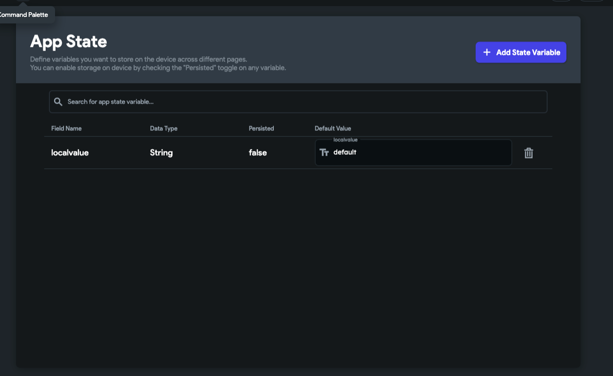

# Getting Output From Custom Widgets Using App State

In certain scenarios, it may be necessary to retrieve output from a custom widget and use it elsewhere within the FlutterFlow project. Since FlutterFlow does not provide a direct way to fetch values from custom widgets, this guide describes an alternative approach using app state variables.

When output needs to be retrieved from a custom widget, the recommended strategy is to store the value inside an app state variable. The app state variable can then be accessed anywhere within the project.

Here are the steps to retrieve output:

  - Step 1: Create a New App State Variable

    - Navigate to the **App State** section and create a new app state variable to store the output value.

      

  - Step 2: Update the App State Variable Within the Custom Widget Code

    - Use `FFAppState()` to update the app state variable directly from the custom widget.

      

      Here is an example of the code you can use to update the app state variable:
      ```dart
      FFAppState().update(() {
        FFAppState().localvalue = 'setvalue';
      });
