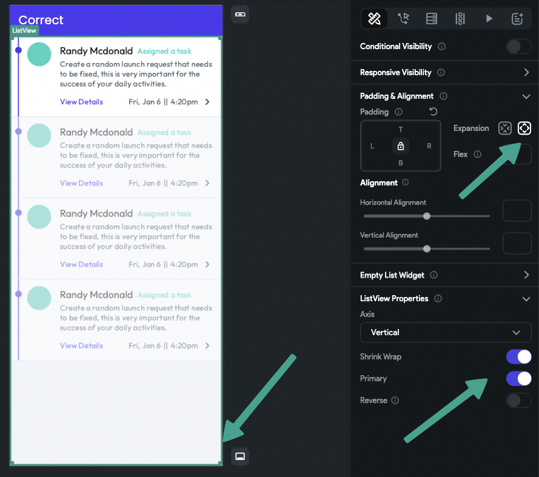
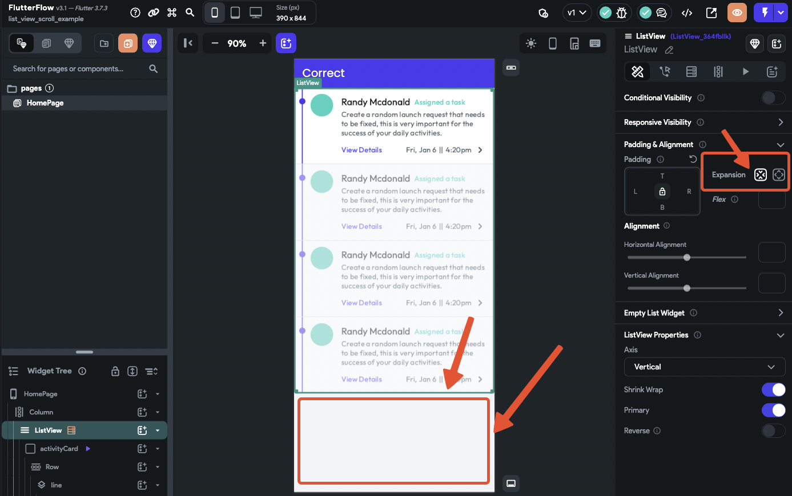

# Infinite Scroll Pagination in ListView

If a `ListView` with **Infinite Scroll** enabled loads all items at once instead of paginating, the issue is typically related to layout configuration. This guide outlines how to correctly structure the widget for proper pagination behavior.

:::info[Prerequisites]
- Infinite Scroll is enabled in the `ListView`.
- The widget is placed inside a layout that allows height constraints to be respected.
:::

Follow the steps below to configure ListView for pagination:

1. **Ensure ListView Has a Defined Height**  
   A `ListView` must have a height constraint to determine the viewport size and paginate correctly. Without a defined height, it will attempt to load all items.

2. **Let ListView Handle Its Own Scrolling**  
   - Disable scrolling in any parent `Column` or scrollable container.  
   - Enable the **Primary** option, and wrap `ListView` in an `Expanded` widget.  
   - This allows `ListView` to control scroll behavior and calculate items to load per page.

      

3. **Wrap ListView Inside a Fixed-Height Container (if nested)**  
   If `ListView` is inside a scrollable parent (like `Column` or `ListView`), wrap it in a `Container` with a defined height (e.g., `500px`). This ensures it doesn't expand indefinitely.

      

4. **Avoid Missing Height Constraints**  
   Without constraints, `ListView` will not know the visible size and will load all data at once, bypassing pagination.

   :::warning
   Placing `ListView` directly inside a scrollable parent without a defined height will break Infinite Scroll behavior.
   :::

5. **Use Layout Structure That Supports Scroll Isolation**  
   Allow `ListView` to scroll independently before the parent scroll takes over. Combine this with defined height and `Expanded` usage for best results.

      

:::tip
To optimize pagination, define consistent item heights and test using varying screen sizes.
:::

:::info[Additional Resources]
- **[ListView Scroll Example Project](https://app.flutterflow.io/project/list-view-scroll-example-wdv076)** – View a working configuration example.
:::
