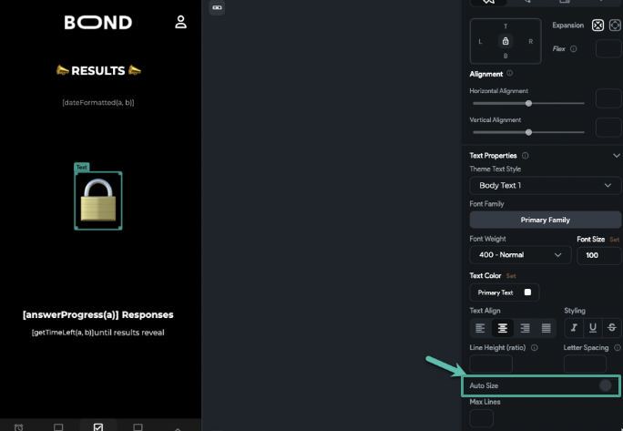

# iOS Emoji Size Issue Fix

In some cases, emojis may render larger than expected on iOS devices, affecting the layout and visual consistency of the application. This guide explains the cause and provides effective solutions to ensure consistent emoji sizing across devices.

**Problem:**  
  - Emojis displayed within text appear oversized on certain iOS devices.
  - This behavior may disrupt the intended design and user experience.

  

## Here is the solution and best practices:

  - **Enable Auto-Size with Fixed-Width Container:**

    - **Reason:** The emoji size is influenced by device configurations and text widget properties.
    - **Steps:**
      - Enable auto-sizing on the `Text` widget.
      - Wrap the `Text` widget inside a `Container` with a fixed width and height.
      - This approach restricts the maximum size of the text, ensuring that the emoji remains within the intended dimensions regardless of auto-sizing adjustments.

    Here is an example that shows the configuration:

      

      - Create a `Container` with fixed dimensions (e.g., `32x32 pixels`).
      - Add a `Text` widget containing the emoji.
      - Set a font size on the `Text` widget.
      - Enable auto-sizing on the `Text` widget.
      - The emoji size will adjust based on the container dimensions but will not exceed its bounds.

      For additional information, refer to the **[official support article](https://intercom.help/flutterflow/en/articles/7044370-text-emoji-is-very-large-on-some-ios-devices)**.
