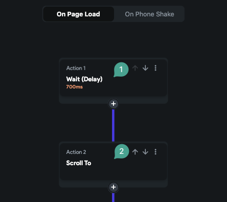
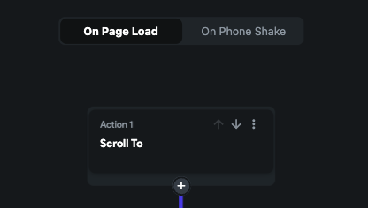

# Scroll To Action on Page Load

When a `Scroll To Action` fails to trigger during a page load, it is often because the scrollable widget has not fully rendered at the time the action executes. This guide outlines how to ensure the scroll action works reliably during page load.

:::info[Prerequisites]
- The `Scroll To Action` is configured inside an `On Page Load` action flow.
- The target widget is inside a scrollable view such as `ListView` or `Column`.
:::

## Steps to Ensure Reliable Scroll Behavior:

1. **Add a Delay Before the Scroll Action**  
   Insert a `Delay Action` before the `Scroll To Action` to allow the widget tree to complete rendering. Recommended delay duration is 500 to 700 ms.

   

2. **Use Load Animations for Scrollable Widgets**  
   Applying an animation ensures the widget is fully visible before scrolling.
   - Add a load animation (e.g., `Fade`) to the scrollable widget.
   - Set the animation duration to approximately `1200 ms`.
   - Add a `Delay Action` before the scroll action (e.g., `700 ms`).

   

   :::tip
   Combining a delay with animation prevents the scroll action from executing before the widget appears, creating a smoother transition.
   :::

:::info[Additional Resources]
Refer to **[Scroll To Action Failing on Page Load](https://intercom.help/flutterflow/en/articles/7047006-scroll-to-action-is-not-working-when-used-on-page-load)** for more troubleshooting help.
:::