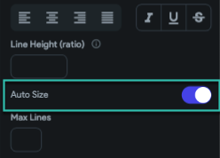
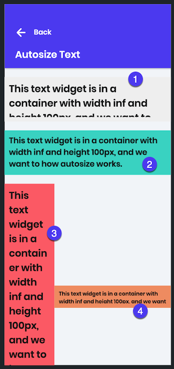

# Text Widget Auto Size Not Working

The `Auto Size` option allows the `Text` widget to automatically reduce its font size to fit inside its parent widget. If you have enabled `Auto Size` on your `Text` widget but the text is not resizing as expected, follow the steps below.

- **Verify Parent Widget Has Defined Width and Height**

  The `Text` widget must be placed inside a widget that has a defined width and height (for example, a `Stack` or `Container`). This allows the `Text` widget to determine how much it should reduce the font size to fit the available space.

    1. Select your `Text` widget.
    2. Locate its parent widget.
    3. Ensure the parent widget has both width and height set.

    Without these constraints, the `Auto Size` feature may not function properly.

- **Auto Size Behavior Examples**

  Here are some examples demonstrating how `Auto Size` behaves depending on the parent container's settings:

  - **Container with width set to `infinity` and height set to `100px`, `Auto Size` disabled**  
  The text will overflow if it doesn't fit.

  - **Container with width set to `infinity` and height set to `100px`, `Auto Size` enabled**  
  The font size is automatically reduced to fit inside the container.

  - **Container with width set to `30%` and no height defined, `Auto Size` enabled**  
  `Auto Size` is enabled but has no effect because the height is undefined.

  - **Container with width set to `70%` and height set to `50px`, `Auto Size` enabled**  
  The text size is reduced to its minimum limit to fit within the available space.

  

:::tip
`Auto Size` is helpful when using percentage-based width and height for responsive UIs. For example, you can set your container width to `30%` and enable `Auto Size` for the text. As the screen size grows, the container width increases, allowing the text size to grow proportionally.
:::

:::note
The font size reduction has a limit. If the container becomes too small, the text may not reduce further, and text clipping or overflow can occur.
:::
