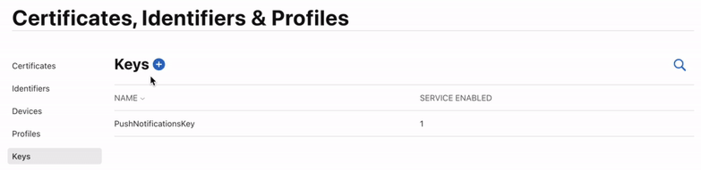
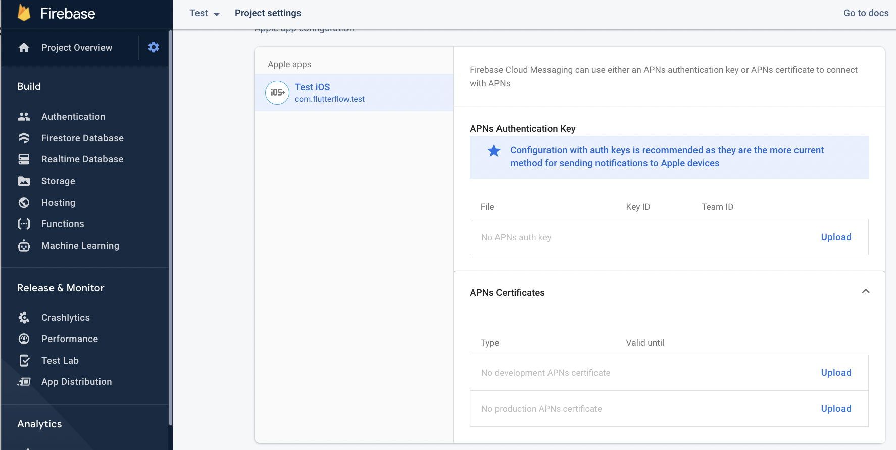
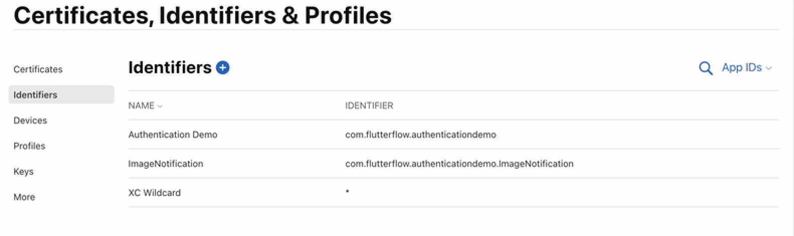

# Advanced Push Notification Troubleshooting

This guide outlines key steps to resolve common issues with push notifications in FlutterFlow.

:::warning
Push notifications will not work in the following cases:
- When using an iOS simulator. Testing must be done on a real device.
- If the user is not logged into the app.
- If the app is currently open on the device.
:::

## 1. Confirm a Push Notification Key Is Created in Apple Developer Console

Apple requires a push notification key to verify the sender. Navigate to:

**Certificates, Identifiers & Profiles → Keys**

If a key has not been created, one must be added.

:::tip
Refer to the [Apple documentation](https://developer.apple.com/account/resources/authkeys/list) for steps to create a push notification key.
:::

## 2. Verify the APN Key Is Uploaded to Firebase

Open the Firebase Console, then go to:

**Project Settings → Cloud Messaging**

Scroll to the iOS section. If no file appears under **APNs Authentication Key**, upload the required key.

:::tip
See [Firebase instructions](https://firebase.google.com/docs/cloud-messaging/ios/client) for uploading the APN key.
:::

## 3. Add a Push Notification Identifier in Apple Developer Console

Navigate to:

**Certificates, Identifiers & Profiles → Identifiers**

If no identifier is configured for push notifications, create one to enable iOS support post-deployment.

:::tip
Refer to the [Apple documentation](https://developer.apple.com/documentation/usernotifications/registering_your_app_with_apns) for creating an identifier.
:::

## 4. Ensure FlutterFlow Is Up to Date

Update FlutterFlow by pressing:

- `Ctrl + R` on Windows
- `Cmd + R` on Mac

After refreshing, clear your browser cache and log back into FlutterFlow.
